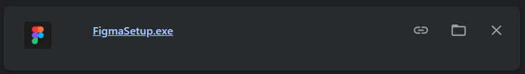
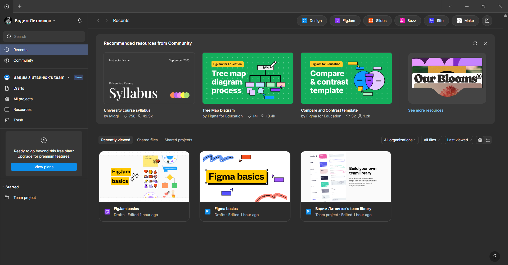

# Практична робота 1
## Огляд сервісів для прототипування

### Хід роботи
1. **Створення облікового запису у Figma**  
   *Реєстрація у сервісі [Figma](https://www.figma.com) за допопмогою облікового запису Google. Нижче знімок екрана вікна авторизації.*

   

3. **Встановлення десктопної версії Figma**  
   *Завантаження Figma на ноутбук. Нижче знімок екрана з виконуваним файлом для встановлення програми.*

   

4. **Перевірка входу в обліковий запис**  
   *Запуск Figma, з авторизованим обліковим записом. Нижче знімок екрана з інтерфейсом десктопної версії Figma* 

   

### Висновки
В ході виконання практичної роботи було виконано перші кроки для роботи з сервісом Figma для прототипування інтерфейсів. Створено обліковий запис, завантажено і встановлено десктопну версію програми. Це є початком для ознайолмлення з можливостями для дизайнерів від цієї програми та для подальшої роботи у ній.
