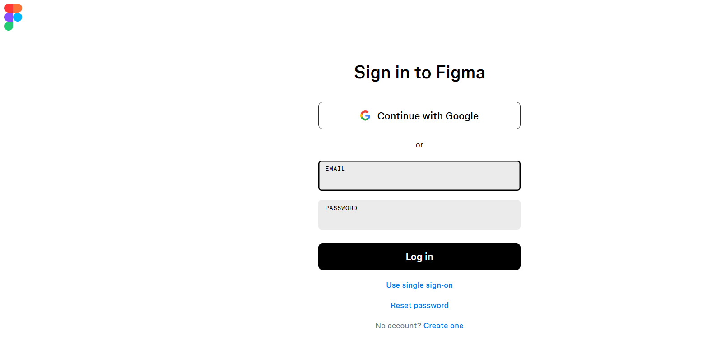

# Практична робота 1
## Огляд сервісів для прототипування

### Хід роботи
1. **Створення облікового запису у Figma**  
   *Реєстрація у сервісі [Figma](https://www.figma.com) за допопмогою облікового запису Google.*

   

2. **Встановлення десктопної версії Figma**  
   *Завантаження Figma на ноутбук.*

   

3. **Перевірка входу в обліковий запис**  
   Запустив Figma, увійшов у свій акаунт. На скріншоті видно інтерфейс із моїм профілем.  

   

## Висновки
- Я створив обліковий запис у Figma, завантажив і встановив десктопну версію програми.  
- На практиці я ознайомився з сервісом для прототипування інтерфейсів.  
- Це дало розуміння того, як організовано робочий простір Figma та які можливості вона надає для дизайнерів.  
