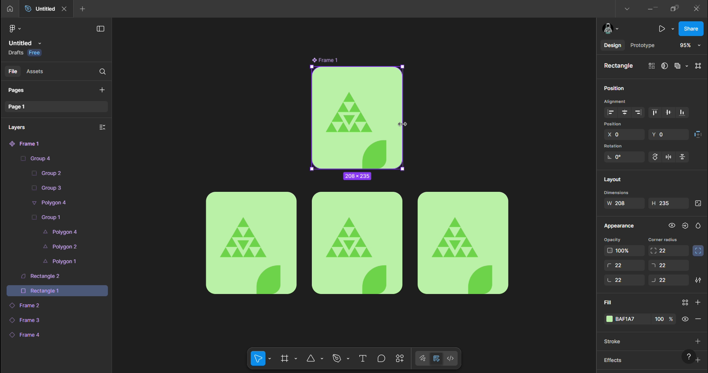
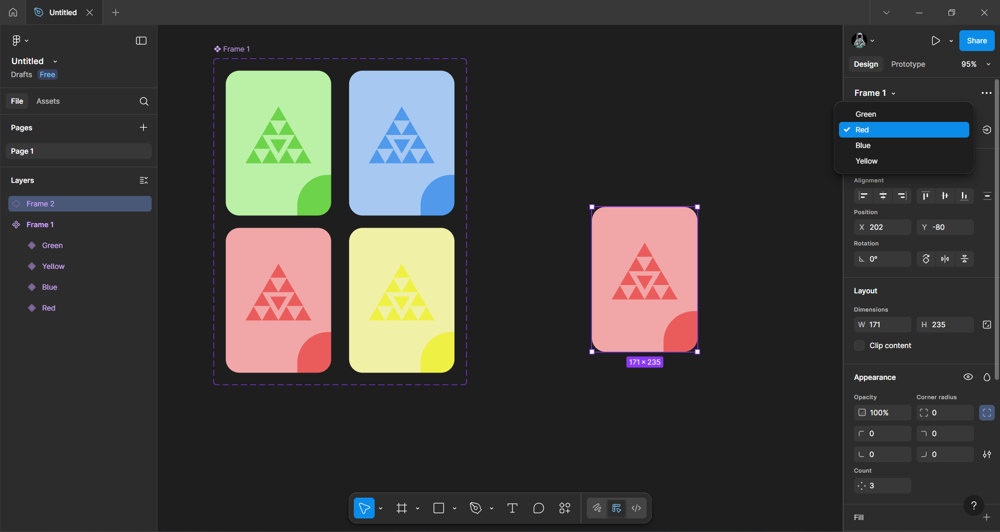
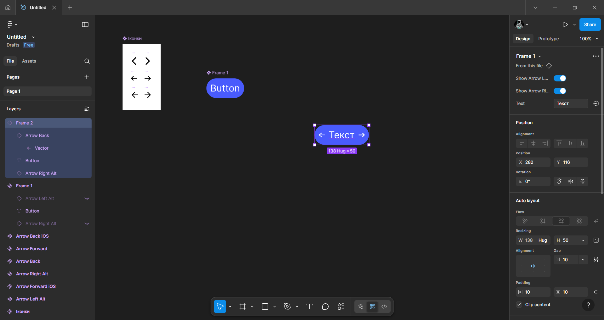
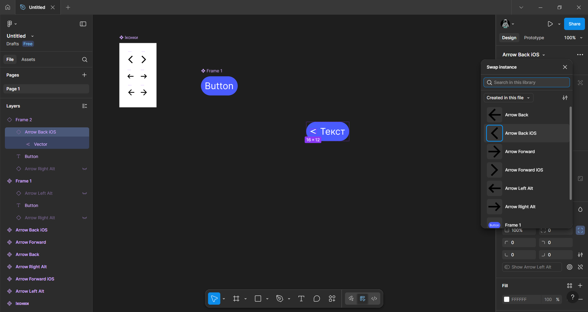

# Практична робота 10
## Компоненти і варіанти у Figma

### Хід роботи 
У даній роботі було опрацьовано теоретичний матеріал про компоненти та варіанти у Figma. З наданих відео: 
- [Figma українською | Про компоненти і варіанти у Фігмі. Вступ](https://www.youtube.com/watch?v=sFvMPRAEJQI&t=1s)
- [Figma українською | Компоненти і варіанти у Фігмі. Частина 2](https://www.youtube.com/watch?v=JJORk40g7AU)
я зрозумів, що компоненти — це елементи інтерфейсу, які створюються один раз, а потім їх можна використовувати багато разів у різних місцях. І що головною перевагою цих елементів є те, що при зміні головного компонента всі його копії також автоматично змінюються. Використання таких компонентів економить час і забезпечує однаковий стиль при виконанні роботи.

А варіанти - функція, яка дозволяє об’єднати кілька різновидів одного і того самого компонента в єдиний компонентний набір. Кожен різновид (наприклад, різний розмір чи різний колір елемента) зберігається всередині цього набору як окремий варіант. А під час роботи можна легко перемикати потрібний варіант через панель властивостей.

Також я зрозумів про існування деяких обмежень щодо копій компонентів. Копії не можна змінювати повністю. Figma дає можливість змінювати: текст, кольори, скруглення кутів, додавати ефекти, а ось положення окремих елементів, розміри фігур і т.д. можна редагувати лише в головному компоненті.

Крім цього, компонентам можна призначати властивості. Властивості компонентів - це спеціальні налаштування, які визначають, що саме в копіях можна змінювати або приховувати. До них належать:
- Текстові властивості - для редагування тексту через панель;
- Булеві властивості - для ввімкнення/вимкнення окремих елементів компонента без створення додаткових варіантів);
- Властивість заміни, яка дозволяє швидко замінювати іконки чи інші вкладені компоненти, якщо вони належать до одного набору.
Властивості роблять компоненти значно гнучкішими й дозволяють змінювати текст, іконки чи інші частини компонента, не порушуючи його структури. Завдяки цьому компоненти стають універсальними та зручними у використанні під час проєктування.

Текстова та булеві властивості

Властивість заміни

### Висновки
У процесі виконання роботи я ознайомився з компонентами й варіантами у Figma. Компоненти забезпечують повторне використання елементів та автоматичне оновлення їх копій, а варіанти дозволяють об’єднувати різні стани компонента в один набір. Також я розглянув текстові, булеві та замінні властивості, які роблять компоненти гнучкими й зручними у налаштуванні. Використання цих можливостей значно спрощує та прискорює процес проєктування інтерфейсів.
