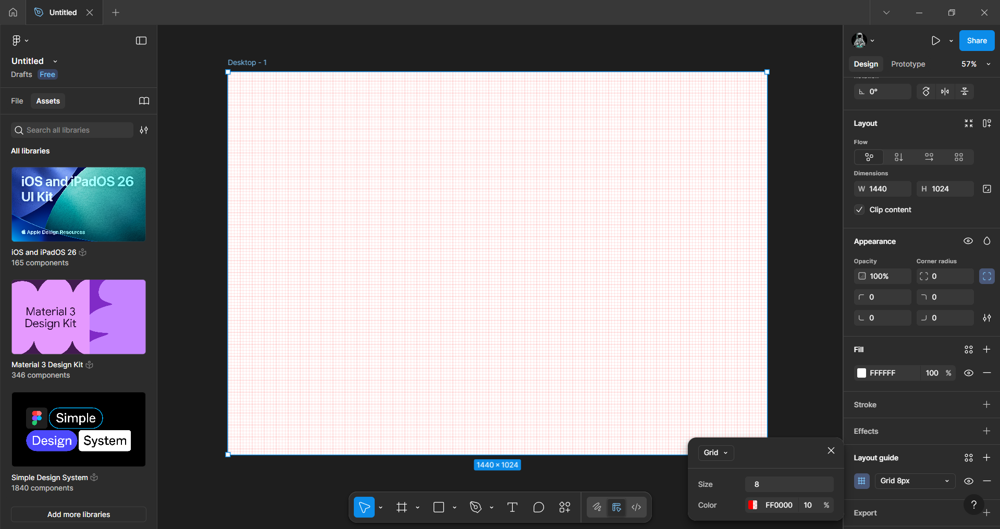
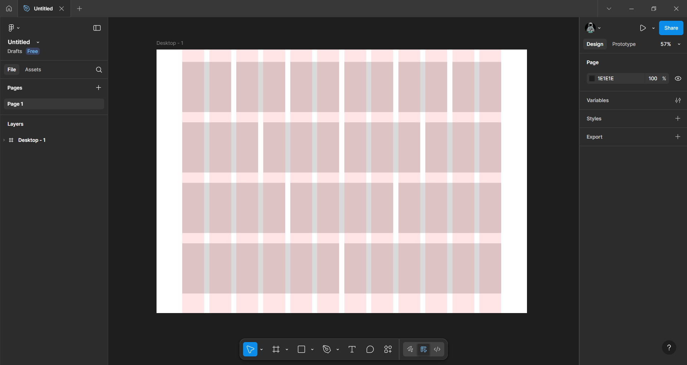
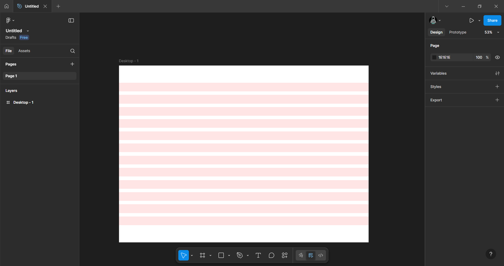

# Практична робота 11
## Сітки у дизайні інтерфейсу

### Мета:
Вивчити принципи створення та керування компонентами, опанувати роботу з варіантами та налаштуванням властивостей для оптимізації процесу проєктування інтерфейсів.

### Хід роботи 
У ході роботи було опрацьовано теоретичний матеріал про сітки у дизайні інтерфейсу:   
- [Figma українською | Сітки. Для чого вони потрібні і як з ними працювати](https://www.youtube.com/watch?v=xeEUYFnewrs)
- [ArmedSoft](https://armedsoft.com/ua/blog/vykorystannya-sitky-u-vebdyzayni?authuser=0)  

В цих матеріалах розповідалося про не обов'язковий, але досить корисний інструмент Figma - про сітку. З відео та інформації на сайті я зрозумів, що сітка - це структура ліній і стовпців, які об'єднують та організовують елементи дизайну. Сітки використовують як структурну основу для веб-сайтів, завдяки чому покращується загальний вигляд сторінки та забезпечується логічне й зручне для користувача розміщення елементів
Сітки поділяються на:
- Піксельна сітка
Дрібна сітка з маленьких квадратів. Вона використовується для зручної побудови дизайну з кратними відступами, щоби елементи гарно вирівнювались та виглядали акуратно. Найпоширенішим розміром "кроку" є 8 px.

- Колончаста сітка
Це сітка, яка складається з вертикальних колонок з відступами між ними, а також можуть бути присутні зовнішні поля. Ці зовнішні поля використовуються для того, щоб контент не розтягувався на всю ширину екрана. А міжколонкові відступи потрібні для того, щоб між різними елементами інтерфейсу зберігався проміжок однакової довжини. Найпопулярнішою колончастою сіткою - є сітка з 12 колонок, тому що її легко ділити на 2, 3, 4, 6 частин.

- Рядкова сітка
Використовується для вертикального вирівнювання елементів. Допомагає утримувати однакові відступи між блоками по вертикалі. І працює аналогічно до колонкової сітки, але в горизонтальному напрямку.

Також зазначалося, що сітка не створює жорсткі рамки. І іноді деякі елементи виносять за межі колонок для покращення композиції або щоб зробити акуент на цьому елементі.

### Висновки
У ході виконання роботи було опрацьовано теоретичні основи використання сіток у дизайні інтерфейсів. З матеріалів, стало зрозуміло що сітка є досить корисним інтрументо, який виступає "скелетом" веб-сторінок. Вона дозволяє систематизувати розміщення елементів та зробити інтерфейс впорядкованим та логічним.
