# Практична робота 12
## Розробка wireframe

### Мета:
Опанувати інструменти Figma для побудови структурних макетів вебсторінок, створити деталізований вайрфрейм інтернет-магазину та розробити інтерактивний прототип для демонстрації навігації й основних сценаріїв взаємодії користувача.

### Хід роботи 
У ході роботи було опрацьовано теоретичні матеріали з наступних джерел:   
- [SKVOT](https://skvot.io/uk/blog/ne-soromno-zapitati-shcho-take-vayrfreym-mokap-i-prototip?authuser=0) - Як створюються цифрові продукти.
- [Прототипування і анімація в Фігмі | Рухаю пікселі #1](https://www.youtube.com/watch?v=Sdmk050xcDA) - Про прототипування в Figma.
- [Переходи, модальні вікна та скрол у протипах Фігми | Рухаю пікселі #2](https://www.youtube.com/watch?v=fe_QfW-6i4w) - Деталізоване прототипування в Figma.
- [6 урок - Figma 2020 - Створення прототипу](https://www.youtube.com/watch?v=Lis9V4rYPzY) - Про створення прототипу в Figma.

Створення прототипу починається з вайрфрейму - схематичного макету структури сайту, чи програми, який показує розташування елементів. Далі на основі вайрфрейму додають візуальні елементи: кольори, шрифти, картинки, іконки. Так розробляється вже статичний дизайн (мокап), який показує, як сторінка виглядатиме в реальності. І в кінці мокап роблять клікабельним: налаштовують кнопки, меню, переходи між сторінками. І на виході можна отримати прототип проєкту.

Для створення деталізованого вайрфрейму інтернет-магазину було використано сайт [Yes, Original](https://yesoriginal.com.ua/uk) як основний референс. Його структура сторінок, логіка роботи елементів, а також частина текстових матеріалів і зображень були запозичені для формування дизайну.
Оскільки базова схема інтерфейсу вже була визначена за референсом, етап побудови чорно-білого вайрфрейму було скорочено. Робота одразу виконувалася у форматі деталізованого мокапу, на який наносилися основні елементи інтерфейсу, який потім було перетворено на інтерактивний прототип.
Також, у роботі використовувалися іконки імпортовані з бібліотек [Google Fonts](https://fonts.google.com/icons) та [ICON-ICONS](https://icon-icons.com/).

Створення сторінок інтернет магазину відбувалося з використанням сітки, для розміщення контенту рівномірно. Також у роботі використовувалися фрейми з функцією Auto Layout для автоматичного розміщення, вирівнювання та розподілення елементів. Крім цього, в роботі використовувалися компоненти та варіанти для швидкого створення повторюваних елементів.

Створені сторінки інтернет-магазину:
* Головна сторінка
* Декілька сторінок товарів
* Модальні вікна різного призначення

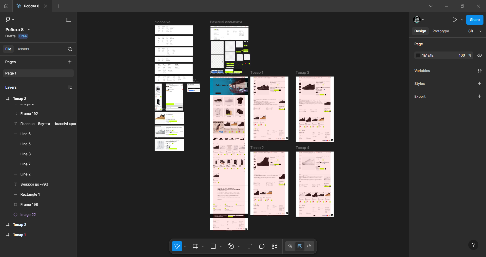

### Головна сторінка 
Головна сторінка інтернет-магазину [Yes, Original](https://yesoriginal.com.ua/uk) має класичну структуру:
* У верхній частині розміщена «шапка» з логотипом, меню категорій, пошуком та іконками облікового запису, уподобань і кошика.

  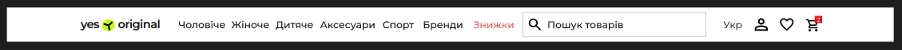
  
* Акційний банер.

  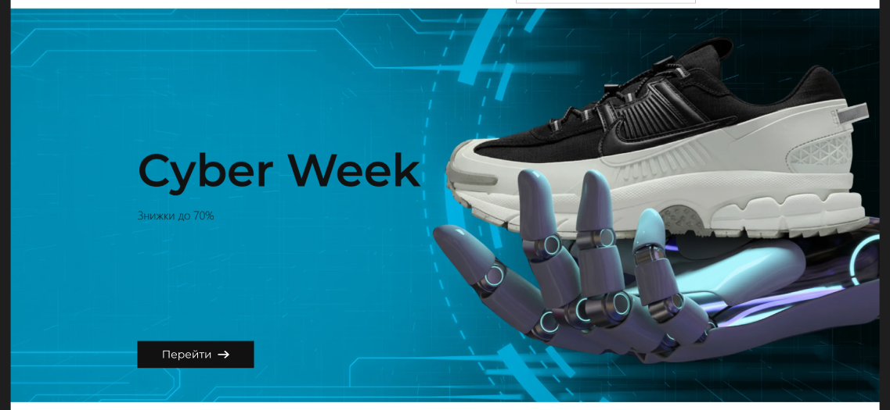
  
* Блок швидкого переходу до ключових категорій товарів.

  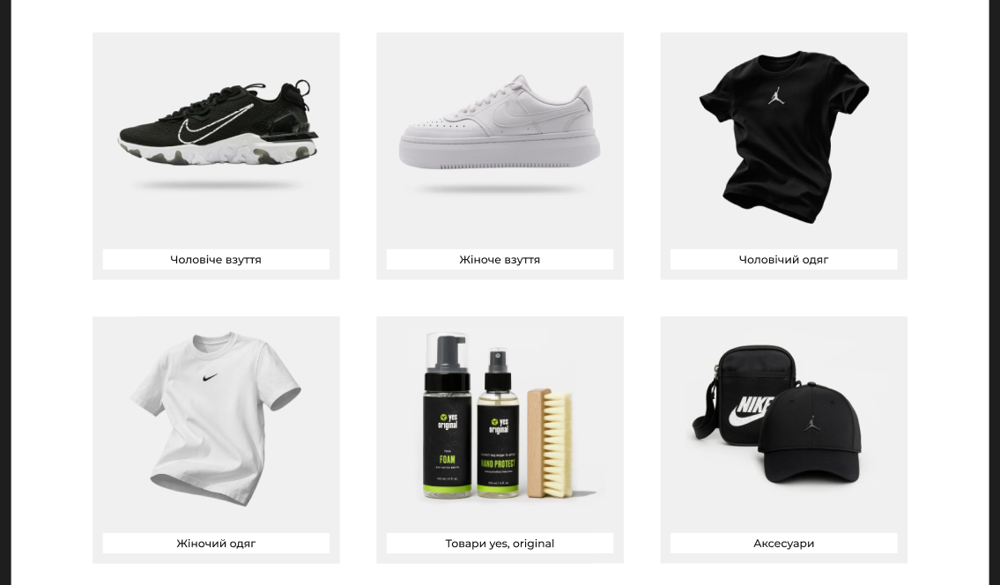
  
* Промоблок із колекцією NATIVE.

  
  
* Ряд логотипів наявних брендів в асортименті магазину.

  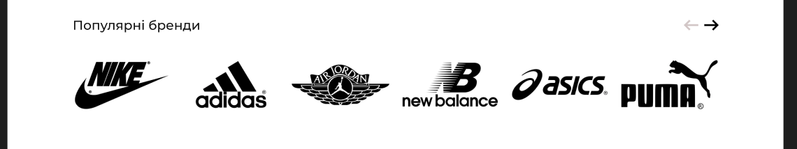
  
* Кілька горизонтальних товарних каруселей («Хіти продажів», «Товари від сайту», «Переглянуті товари»).

  
  
* Інформаційний блок про переваги магазину.

  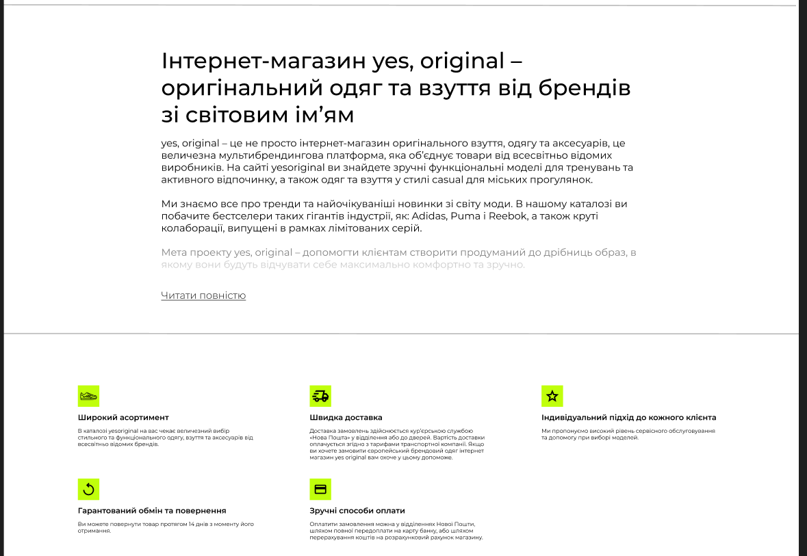
  
* Та футер з посиланнями, формою підписки й інформацією про способи оплати наприкінці сторінки.

  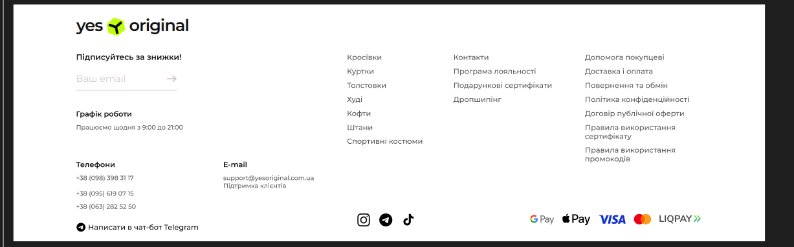

### Сторінки товарів  
Сторінки детального перегляду товару мають однакову структуру: 
* У верхній частині, окрім шапки, розміщено навігаційну доріжку, яка показує шлях до товару.

  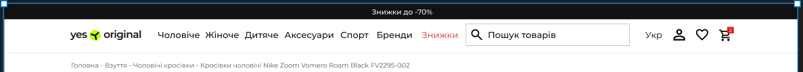
  
* Фото товару з інформаційним блоком (назвою, артикулом, старою та акційною ціною), розмірною сіткою та кнопками «Купити», «Додати в улюблене».

  
  
* Далі інформація про товар, його особливості та характеристики.

  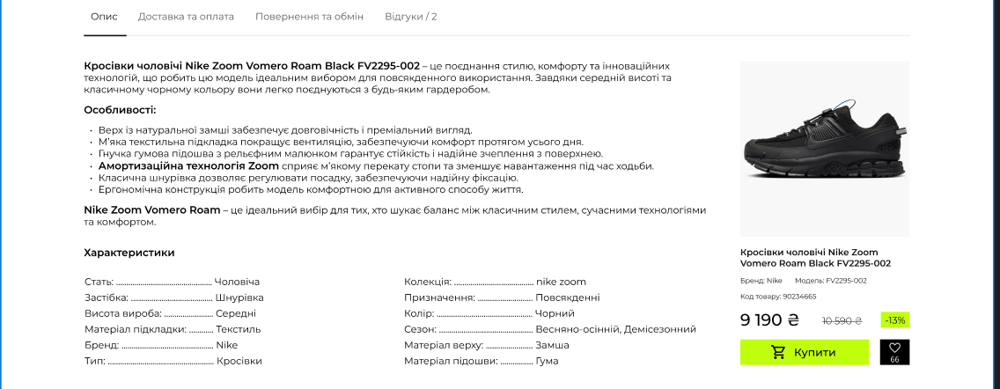
  
* Блок рекомендацій «Ви дивилися».

  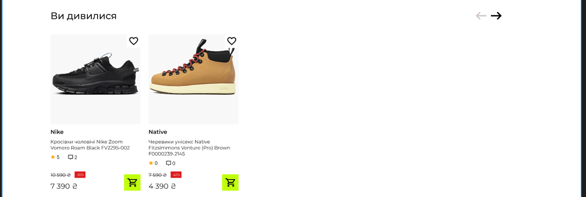
  
* Та стандартний футер з навігацією, підпискою й контактами.

### Модальні вікна з відображенням детальних категорій товарів  
Модальні вікна, які містять деталізовані підкатегорії одягу, взуття та верхнього одягу для чоловіків, жінок і дітей; аксесуари та супутні товари. Мають фільтрацію за призначенням, групуючи спортивний одяг, взуття та аксесуари за видами спорту. Та перелік брендів-партнерів для прямого переходу до асортименту виробника.

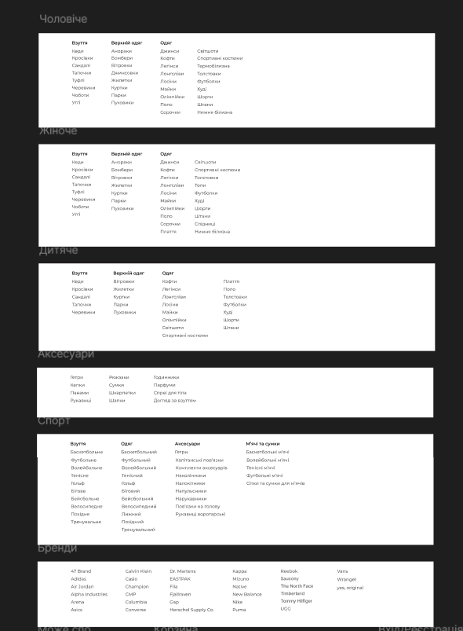

### Модальне вікно авторизації 
Модальне вікно, де виконується вхід, або реєстрація за телефоном, або через Google / Apple ID.

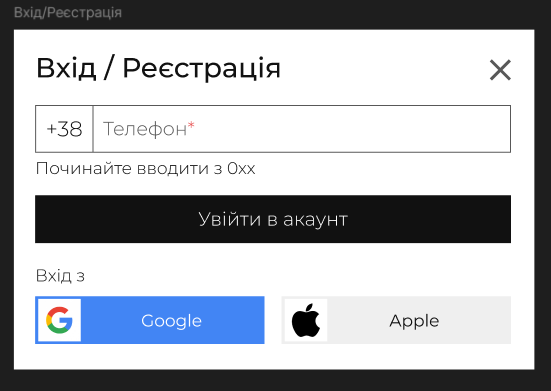

### Модальне вікно кошика  
Модальне вікно кошика в якому показуються додані товари з короткою інформацією про них, поле для використання купона та загальна ціна. Крім спрощеного вікна кошика, з ним з'являється інше модальне вікно «Вам сподобається» з рекомендованими товарами.

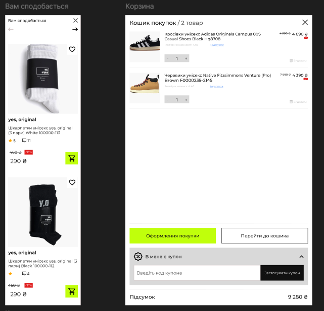

### Модальні вікна швидкої покупки  
При додаванні товару у кошик з товарних каруселей, з'являються модальні вікна для вибору опцій (розміру, кольору) та миттєвого додавання до кошика.

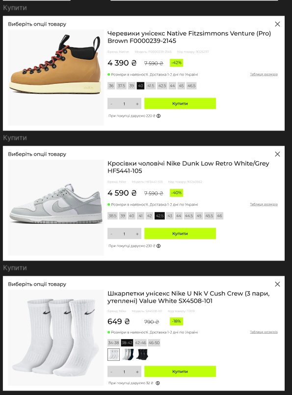

Після створення макету сайту було налаштовано переходи та анімацію між сторінками й зміна деяких елементів за допомогою інструментів прототипування у Figma.

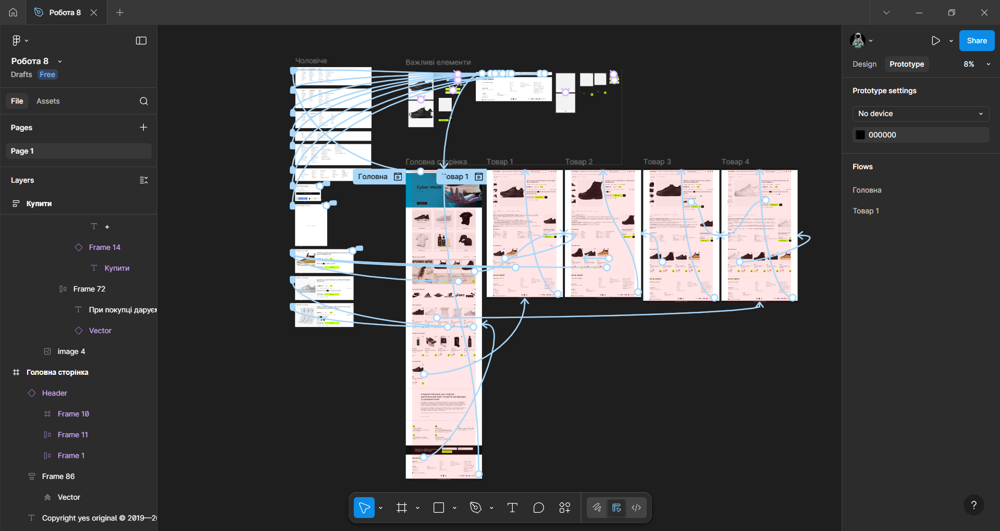

Були налаштовані наступні анімації:  
Наведення:

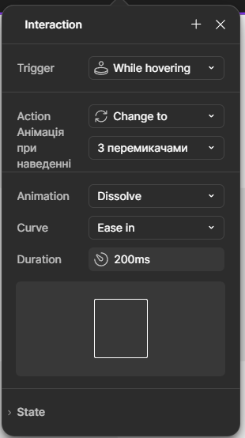

* При наведенні на головне фото на сторінках товару на ньому з'являються перемикачі, як для перегляду галереї.
* При наведенні на картки категорій на головній сторінці на них збільшується фото.
* При наведенні на кнопки купити вони змінюють свій колір на світліший.
* При наведенні на кнопки входу/реєстрації у вікні авторизації вони змінюють свій колір.
* При наведенні на кнопки в вікні кошика вони змінюють своє забарвлення.
* При наведенні в шапці сайту на одну з категорій (чоловіче - бренди) вспливає модальне вікно з детальними підкатегоріями.

Клік:  

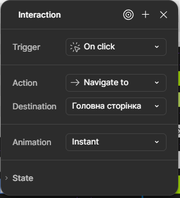

* Після кліку на логотип сайту в шапці виконується перехід на головну сторінку.
* Після кліку на іконку авторизації вспливає модальне вікно авторизації.
* Після кліку на іконку кошика в шапці сайту відкривається вікно кошика.
* Після кліку на хрестики у будь-якому модальному вікні, воно зачиняється.
* Після кліку на корзину в картці товару «Черевики унісекс Native Fitzsimmons Venture (Pro) Brown F0000239-2145» відкриваєтся вікно швидкої покупки.
* Після кліку на корзину в картці товару «Кросівки чоловічі Nike Dunk Low Retro White/Grey HF5441-105» на головній сторінці відкриваєтся вікно швидкої покупки.
* Після кліку на корзину в картці товару «Шкарпетки унісекс Nike Everyday Ltwt Crew (3 пари, неутеплені) SX7676-100» на головній сторінці відкриваєтся вікно швидкої покупки.
* Після кліку на товар «Черевики жіночі Native Johnny Treklite Black 41108330-1001» виконується перехід на відповідну сторінку товару.
* Після кліку на товар «Кросівки чоловічі Nike Air Force 1 07 Black 315122-001/CW2288-001» виконується перехід на відповідну сторінку товару.
* Після кліку на товар «Кросівки чоловічі Nike Air Force 1 Low 07 White CW2288-111» виконується перехід на відповідну сторінку товару.
* Після кліку на товар «Кросівки чоловічі Nike Zoom Vomero Roam Black FV2295-002» виконується перехід на відповідну сторінку товару.
* Після кліку на кнопку внизу сторінки виконується перелистування до верхівки.
* Після кліку на інший колір кросівок на сторінці про «Кросівки чоловічі Nike Air Force 1 07 Black 315122-001/CW2288-001» виконується перехід на сторінку з товаром «Кросівки чоловічі Nike Air Force 1 Low 07 White CW2288-111».
* Після кліку на інший колір кросівок на сторінці про «Кросівки чоловічі Nike Air Force 1 Low 07 White CW2288-111» виконується перехід на сторінку з товаром «Кросівки чоловічі Nike Air Force 1 07 Black 315122-001/CW2288-001».

Автоперехід:  

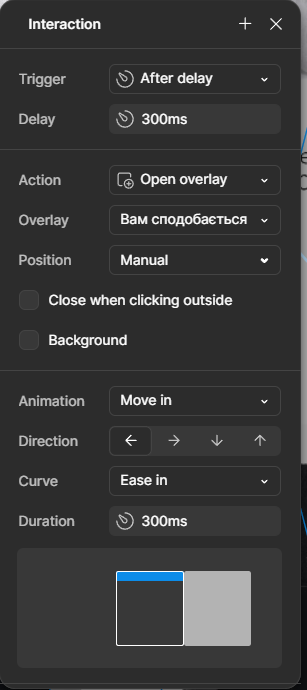

* Після відкриття кошику через шапку сайту, через декілька секунд спливає вікно «Вам сподобається».

*Посилання на роботу:*   
[Інтернет-магазин](https://www.figma.com/design/378DcinvPzn3R2E8tYgNYB/%D0%A0%D0%BE%D0%B1%D0%BE%D1%82%D0%B0-8?node-id=0-1&t=Zkgulz1OsB7ojnpP-1)

### Висновки
У роботі було створено деталізований макет інтернет-магазину [Yes, Original](https://yesoriginal.com.ua/uk) та на його основі розроблено інтерактивний прототип у Figma. Для цього було застосовано низку інструментів Figma: сітку, Auto Layout, компоненти, варіанти й анімації. Було розроблено основні сторінки (Головна, Сторінки товарів) та декілька модальних вікон. При створенні клікабельного прототипу сторінки та модальні вікна були об’єднані логічними переходами та деякими ефектами взаємодії. Робота дала практичні навички проєктування інтерфейсу, структурування контенту та налаштування інтерактивності, що є важливими етапами у створенні сучасних вебдизайнів.
