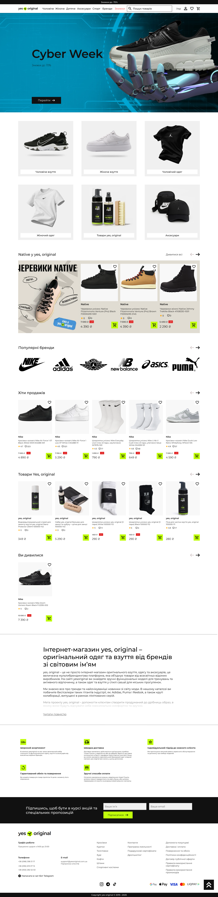
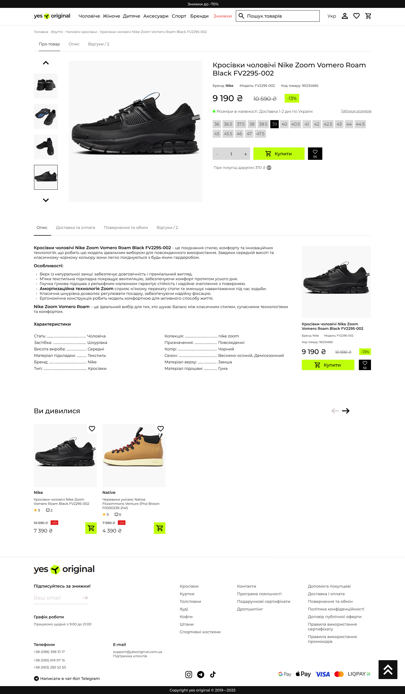
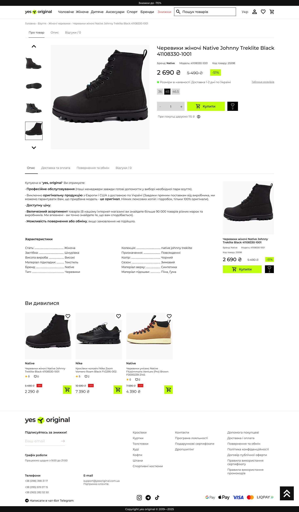
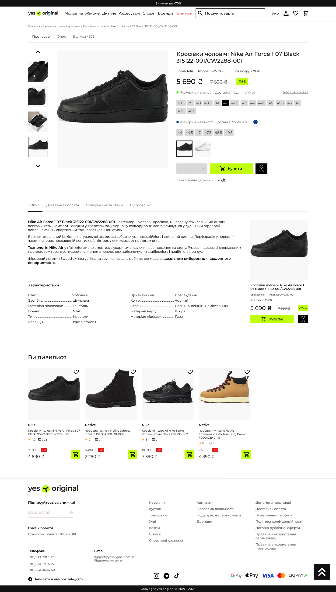
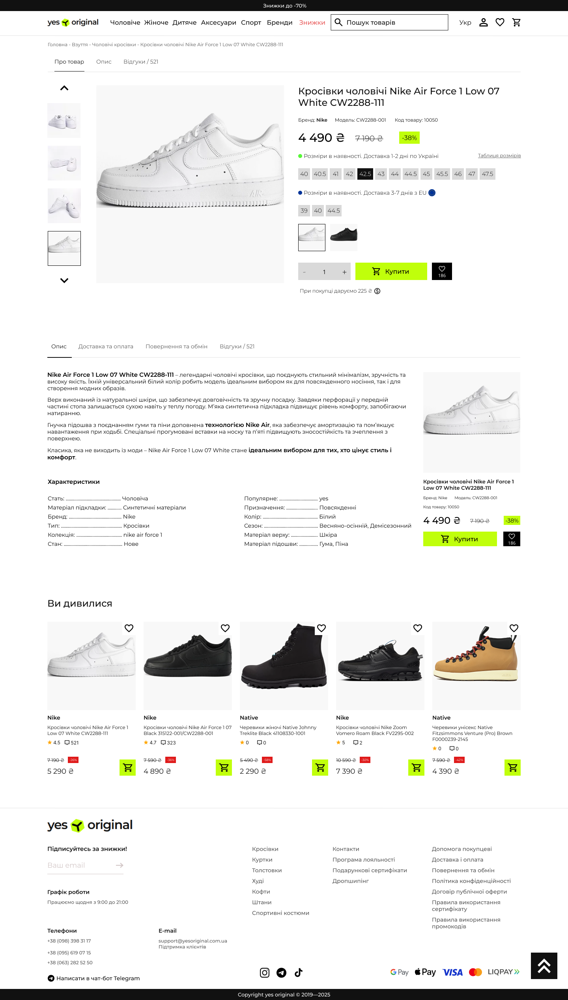
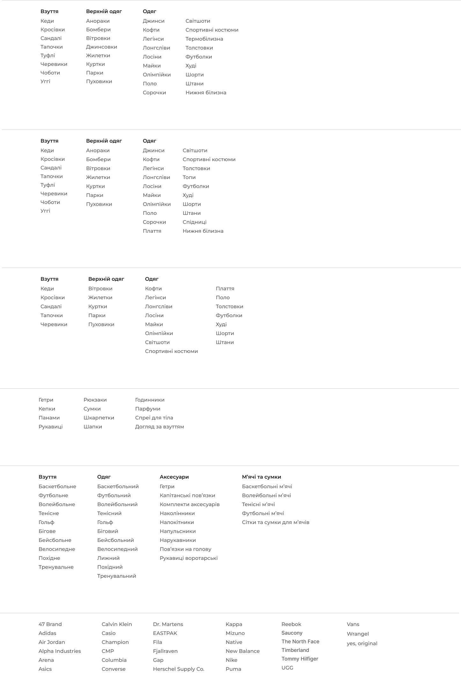
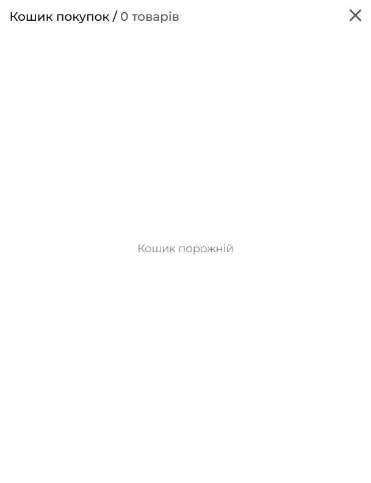
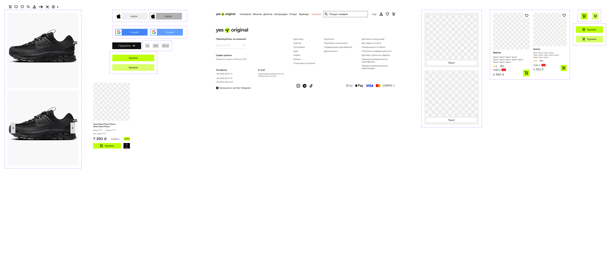

# Практична робота 12
## Розробка wireframe

### Мета:
Опанувати інструменти Figma для побудови структурних макетів вебсторінок, створити деталізований вайрфрейм інтернет-магазину та розробити інтерактивний прототип для демонстрації навігації й основних сценаріїв взаємодії користувача.

### Хід роботи 
У ході роботи було опрацьовано теоретичні матеріали з наступних джерел:   
- [SKVOT](https://skvot.io/uk/blog/ne-soromno-zapitati-shcho-take-vayrfreym-mokap-i-prototip?authuser=0) - Як створюються цифрові продукти.
- [Прототипування і анімація в Фігмі | Рухаю пікселі #1](https://www.youtube.com/watch?v=Sdmk050xcDA) - Про прототипування в Figma.
- [Переходи, модальні вікна та скрол у протипах Фігми | Рухаю пікселі #2](https://www.youtube.com/watch?v=fe_QfW-6i4w) - Деталізоване прототипування в Figma.
- [6 урок - Figma 2020 - Створення прототипу](https://www.youtube.com/watch?v=Lis9V4rYPzY) - Про створення прототипу в Figma.

Створення прототипу починається з вайрфрейму - схематичного макету структури сайту, чи програми, який показує розташування елементів. Далі на основі вайрфрейму додають візуальні елементи: кольори, шрифти, картинки, іконки. Так розробляється вже статичний дизайн (мокап), який показує, як сторінка виглядатиме в реальності. І в кінці мокап роблять клікабельним: налаштовують кнопки, меню, переходи між сторінками. І на виході можна отримати прототип проєкту.

Для створення деталізованого вайрфрейму інтернет-магазину було використано сайт [Yes, Original](https://yesoriginal.com.ua/uk) як основний референс. Його структура сторінок, логіка роботи елементів, а також частина текстових матеріалів і зображень були запозичені для формування дизайну.
Оскільки базова схема інтерфейсу вже була визначена за референсом, етап побудови чорно-білого вайрфрейму було скорочено. Робота одразу виконувалася у форматі деталізованого мокапу, на який наносилися основні елементи інтерфейсу, який потім було перетворено на інтерактивний прототип.
Також, у роботі використовувалися іконки імпортовані з бібліотек [Google Fonts](https://fonts.google.com/icons) та [ICON-ICONS](https://icon-icons.com/).

Створені сторінки інтернет-магазину:
* Головна сторінка
* Декілька сторінок товарів
* Модальні вікна різного призначення

1 *Головна сторінка*
Головна сторінка інтернет-магазину Yes, Original побудована для швидкої навігації та зручного доступу до основних розділів. У верхній частині розміщена "шапка" з логотипом, меню категорій, пошуком та іконками облікового запису, уподобань і кошика. Нижче знаходиться акційний банер, а під ним блок швидкого переходу до ключових категорій товарів. Далі розміщено промоблок із колекцією NATIVE, ряд логотипів партнерських брендів та кілька горизонтальних товарних каруселей («Новинки», «Хіти продажів», «Переглянуті товари»). Наприкінці сторінки подано інформаційний блок про переваги магазину та футер з посиланнями, формою підписки й інформацією про способи оплати.

2 *Сторінки товарів*
Сторінки детального перегляду товару має однакову структуру. У верхній частині розміщено навігаційну доріжку, яка показує шлях до товару. Двлі головне фото та галерею мініатюр, а поряд інформаційний блок із назвою, артикулом, старою та акційною ціною, розмірною сіткою та кнопками «Купити», «Додати в улюблене». Нижче інформація поділена на вкладки: «Опис», «Доставка та оплата», «Повернення та обмін», «Відгуки», де подано особливості та характеристики товару. В кінці сторінки розташовано блок рекомендацій «Ви дивилися» та стандартний футер з навігацією, підпискою й контактами.

3 *Модальні вікна з відображенням категорій товарів*
У шапці сайту реалізовані модальні вікна, які спливають при наведенні на відповідну категорію меню, забезпечуючи багаторівневу навігацію без переходу на інші сторінки. Вони містять деталізовані підкатегорії одягу, взуття та верхнього одягу для чоловіків, жінок і дітей; аксесуари та супутні товари. Вони мають фільтрацію за призначенням, групуючи спортивний одяг, взуття та аксесуари за видами спорту. Та мають перелік брендів-партнерів для прямого переходу до асортименту виробника.

4 *Модальне вікно авторизації*
Модальне вікно авторизації з темним фоном включає вхід за телефоном (+38) і кнопки швидкого входу через Google та Apple ID.

5 *Модальне вікно корзини*
Модальне вікно кошика з шапки сайту буде показувати статус та кількість позицій даданих у кошик.

6 *Модальні вікна швидкої покупки*
Для швидкої покупки з товарних каруселей використовуються спливаючі модальні вікна для вибору опцій (розмір, колір) та миттєвого додавання до кошика.

7 *Вікно компонентів*
Вікно компонентів містить макети для швидкого створення карток товарів, варіанти реакцій кнопок на дії користувача, хедер з її основними компонентами та інформаційний блок футера з посиланнями, соцмережами і платіжними системами.

*Посилання на роботу:*   
[Wireframe](https://www.figma.com/design/378DcinvPzn3R2E8tYgNYB/%D0%A0%D0%BE%D0%B1%D0%BE%D1%82%D0%B0-8?node-id=0-1&t=Zkgulz1OsB7ojnpP-1)

### Висновки
Під час роботи було створено деталізований клікабельний вайрфрейм інтернет-магазину "yes, original" у Figma для десктопних екранів. Були розроблені основні сторінки (Головна, Сторінка товару) та декілька модальних вікон. Також створено бібліотеку компонентів для забезпечення єдиного стилю інтерфейсу. Робота допомогла відпрацювати навички структурного планування, проєктування зручного інтерфейсу для інтернет-магазину, створення повторюваних компонентів і налаштування прототипів для тестування користувацьких сценаріїв.
