# Практична робота 13
## Дослідження кольорових гармоній та інструментів аналізу кольору в [Adobe Color](https://color.adobe.com/)

### Мета:   
* Ознайомитися із поняттям кольорової гармонії та основними типами гармонії кольорів. 
* Навчитися використовувати колірне колесо для побудови палітр за різними принципами гармонії.
* Ознайомитися із можливостями автоматичного виділення колірних палітр із зображень та створювати градієнти.
* Навчитися перевіряти контрастність кольорових пар відповідно до стандартів доступності (WCAG).

### Теоретична частина 
Кольорова гармонія - це поєднання кольорів, яке виглядає візуально збалансовано, приємно та логічно. Вона потрібна в дизайні для створення емоційної виразності, акцентів, структури інтерфейсу та комфортного сприйняття контенту. Гармонійні кольори допомагають привертати увагу, підсилювати стиль і покращувати читабельність.  

Типи кольорової гармонії:
* Analogous (Аналогічна)
* Monochromatic (Монохроматична)
* Triad (Тріада)
* Complementary (Комплементарна)
* Split Complementary (Розділена комплементарна)
* Square (Квадратна)
* Custom (Власна побудова)

### Хід роботи 
**Робота з колірним колесом (Color Wheel)**
1. *Вибір базового кольору.*
   
   
   
2. *Створення палітри для кожного типу гармонії.*

   * Analogous (Аналогічна):

     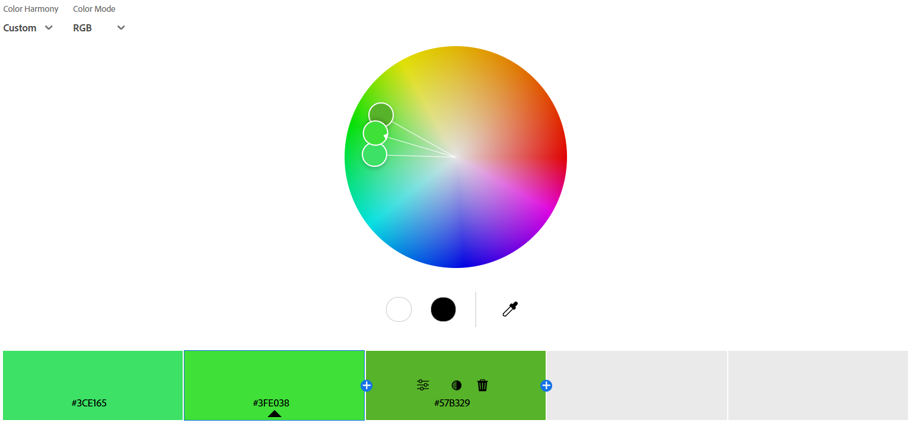

     Логіка аналогічної гармонії полягає у використанні відтінків, що розташовані поруч на колірному колі, завдяки чому палітра виглядає м’яко та узгоджено.  
     Емоційний ефект - Палітра асоціюється з природою, що створює відчуття свіжості, спокою та гармонії.
     
   * Monochromatic (Монохроматична):
  
     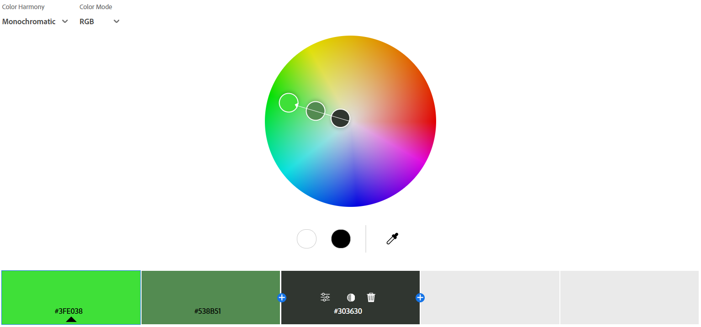

     Монохромна гармонія складається з одного кольору, але з використанням його світліших, темніших та приглушених версій.  
     Емоційний ефект - Палітра викликає відчуття стриманості, мінімалістичності та стабільності.
     
   * Triad (Тріада):
     
     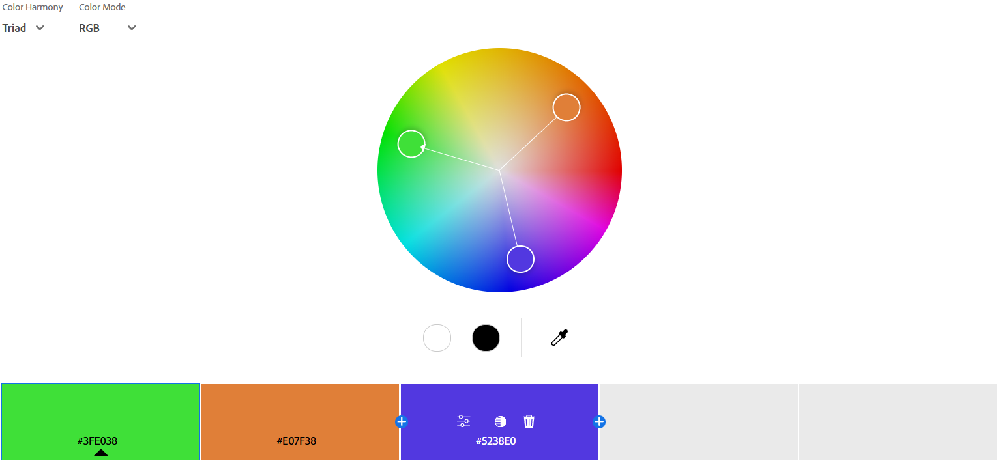

     Тріадична гармонія (Тріада) - це поєднання трьох кольорів, які рівновіддалені один від одного по колірному колу, утворюючи рівносторонній трикутник.  
     Емоційний ефект - Асоціюється з авангардизмом у мистецтві, викликає інтерес та здивування.
     
   * Complementary (Комплементарна):
     
     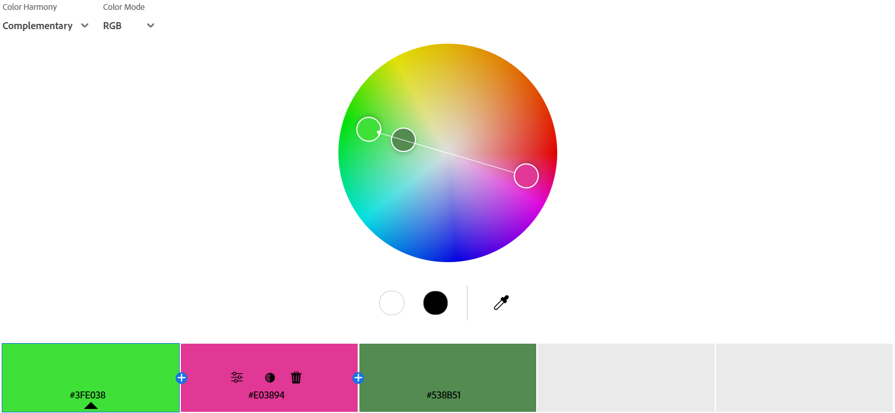

     Логіка комплементарної гармонії полягає у використанні кольорів, які розташовані прямо навпроти один одного на колірному колі.  
     Емоційний ефект - Поєднання кольорів нагадує кавун, що викликає літнє тепло, солодкий смак, відчуття свіжості та насолоди.
     
   * Split Complementary (Розділена комплементарна):
    
     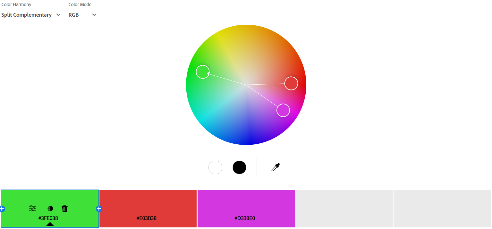

     Логіка побудови розділеної комплементарної гармонії полягає у використанні базового кольору та двох кольорів, які знаходяться поруч із його прямим комплементарним кольором на колірному колі.  
     Емоційний ефект - Палітра асоціюється з драже Skittles, що викликає яскраві, трохи кислуваті, фруктові смаки.
      
   * Square (Квадратна):
     
     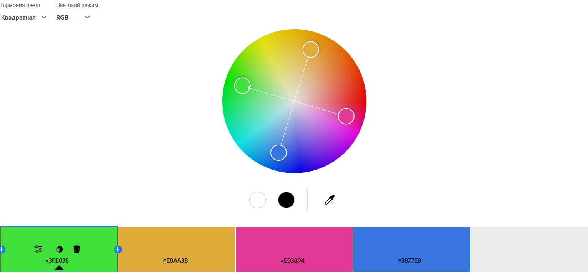

     Квадратна гармонія складається з чотирьох кольорів, рівномірно розташованих на колірному колі (з кутом 90° між сусідніми).  
     Емоційний ефект - Викликає відчуття динамічності, але водночас балансу між теплом і холодом.
      
   * Custom (Власна побудова):
     
     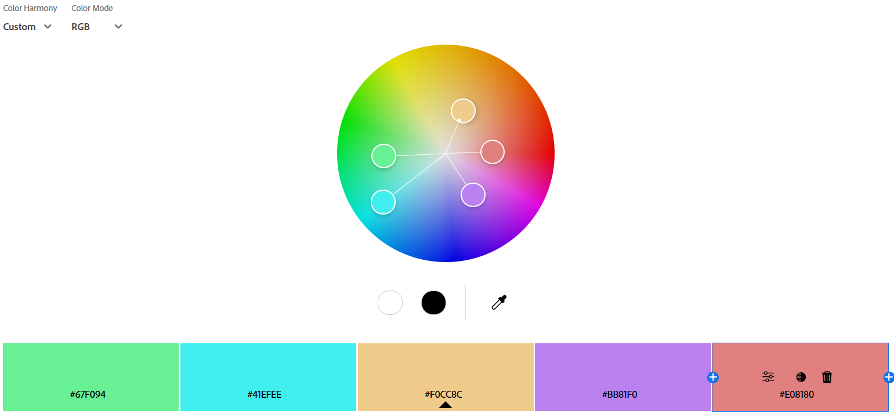

     Логіка побудови гармонії полягає у вільному виборі кольорів.  
     Емоційний ефект - Поєднання кольорів викликає відчуття спокою, м'якості, затишку та легкості.
      
**Створення палітри зображенням (Extract Theme)**
1. *Створення палітри у двох варіантах настрою.*

   * Colorful:
     
     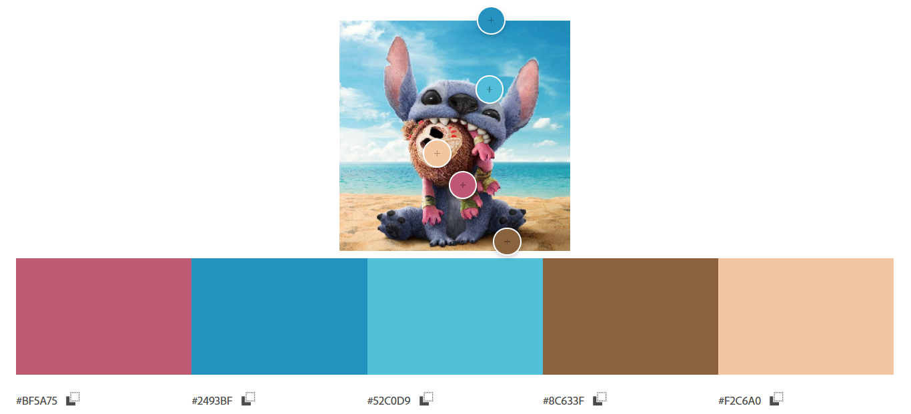

   * Muted:
  
     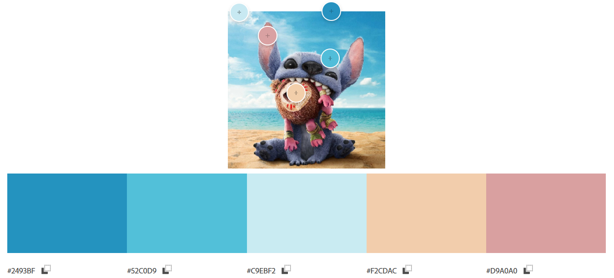

2. *Вибір палітри, яка більше підходить для інтерфейсу додатка.*  
   Colorful (Барвиста): Яскрава, динамічна, в ній використовується контраст теплих з холодними кольорами, що робить палітру візуально привабливою.  
   Muted (Приглушена): В міру яскрава, не така контрастна, в ній присутній плавний, збалансований перехід від холодних кольорів до теплих, гармонійна і приємна для очей.  
   Для інтерфейсу додатка краще підійде приглушена палітра, через плавність та помірну яскравість, яка не втомлюватиме очі під час тривалого використання. М'які кольори не будуть відвертати користувачів від інформації та функціональності інтерфейсу. Використання даної палітри забезпечить високу зручність використання та сприятиме позитивному користувацькому досвіду.

**Створення градієнта на основі зображення (Extract Gradient)**  
*Створення градієнта на основі зображення з трьома кольоровими точками.*

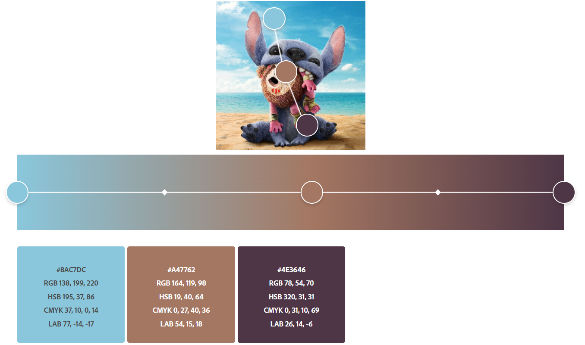

Отриманий градієнт, побудований на основі трьох кольорових точок, використовує контрастний перехід від світло-блакитного до темно-коричневого з фіолетовим підтоном з тепло-коричневим проміжним кольором.

**Аналіз контрасту (Accessibility Tools)**
1. *Вибір однієї пари кольорів для тексту та фону, використовуючи кольори із попередніх палітр.*  
   Для аналізу контрастності були обрані кольори з палітри Custom. Для тексту обрано #F0CC8C, а для фону - #F0CC8C.
   
2. *Перевірка контрастності у Accessibility Tools.*
   
   
   
3. *Аналіз отриманих результатів.*
   Рівень контрасту між текстом (#F0CC8C) та фоном (#F0CC8C) становить 1.8:1. Як для звичайного тексту (рівень AA), так і для великого (рівень AAA) дана пара кольорів не проходить перевірку, оскільки різниця в яскравості та сприйнятті кольорів занадто мала для забезпечення читабельності.  
   Для забезпечення належної читабельності та доступності було застосовано рекомендовану корекцію кольору. Текст залишився без змін (#F0CC8C), а фон було затемнено (#7A4443), у результаті чого контраст між текстом і фоном підвищився. Після корекції контраст становить 5.02:1. Нова пара кольорів пройшла вимоги рівня AA для звичайного тексту, але лише частково відповідає вимогам рівня AAA для великого тексту.

   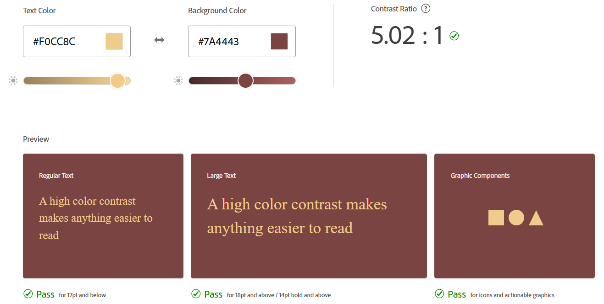

   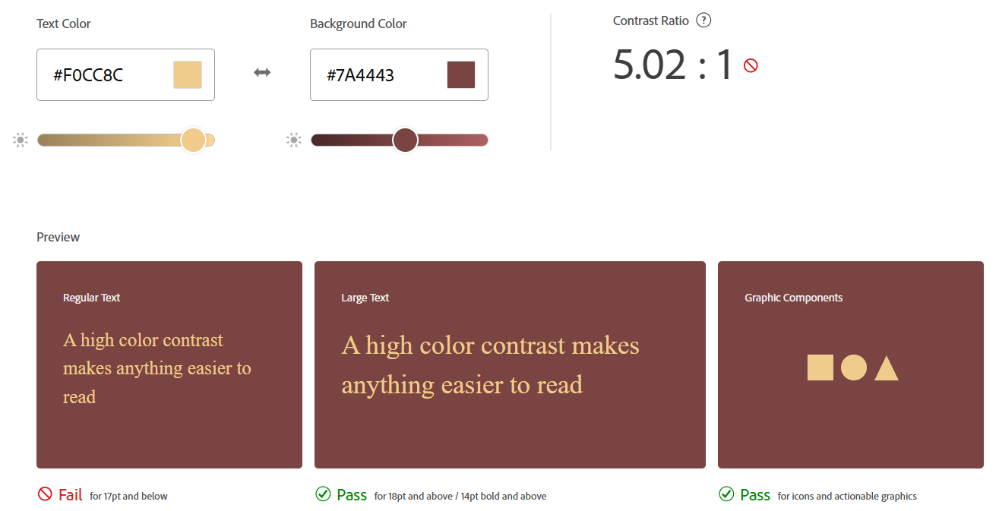

   Тому для забезпечення як вимогам рівня АА, так і рівня ААА було повторно обрано одну з рекомендованих корекцій кольору. Після чого рівень контрасту між текстом (#F0CC8C) та фоном (#5C3231) становить 7.02:1, що задовільняло вимогам обох рівнів.

   

### Висновки
З даної роботи, на мою думку, для інтерфейсів найкраще підійдуть монохроматичні та аналогічні
