# Практична робота 14
## Оптимізація зображень за допомогою [Squoosh](https://squoosh.app/)

### Мета:   
* Ознайомитися із методами стиснення зображень та їхнім впливом на якість. 
* Навчитися визначати оптимальний баланс між якістю та розміром файлу.
* Ознайомитися із різними типами стиснення: без втрат (lossless) та з втратами (lossy).
* Дослідити вплив зміни розміру на якість зображення та вагу файлу.
* Навчитися адаптувати зображення для різних цільових застосувань:
  - Веб (оптимізація для швидкого завантаження).
  - Мобільні пристрої (зменшені розміри, ефективне стиснення).
  - Retina-дисплеї (2x, 3x версії для збереження якості).

### Теоретична частина 
Squoosh - це веб-додаток від Google для стиснення, конвертації та оптимізації зображень без встановлення додаткового програмного забезпечення. Усі операції виконуються прямо в браузері, що робить процес швидким та безпечним, оскільки файли не надсилаються на сервер.

Після завантаження зображення Squoosh автоматично підключає потрібні кодеки (JPEG, MozJPEG, WebP, AVIF, OxiPNG тощо), реалізовані через WebAssembly. Завдяки цьому обробка відбувається локально: інструмент дозволяє застосовувати стиснення, змінювати розмір, регулювати якість та конвертувати між форматами. Для зручності реалізовано порівняння «до/після» за допомогою інтерактивного повзунка, що дозволяє оцінити зміни перед збереженням оптимізованого файлу.

Squoosh підтримує різні типи стиснення, які можна розділити на дві основні категорії:
* Стиснення без втрати (lossless) - Зберігає 100% деталізаціїта якості, що робить його ідеальним для графіки, іконок та зображень, де важлива абсолютна точність кольорів.
  - PNG
  - WebP (lossless)
* Стиснення з втратою (lossy) - Дозволяє значно зменшити розмір файлу за рахунок часткової втрати якості.
  - MozJPEG
  - WebP (lossy)
  - AVIF

Одним із найефективніших методів зменшення ваги файлу є зменшення його роздільності (кількості пікселів). Хоча це може вплинути на чіткість та деталізацію, розмір зображення підбирається відповідно до його призначення (наприклад, для прев'ю чи повноекранного відображення).

Дисплеї з високою щільністю пікселів (т.зв. Retina-дисплеї) потребують зображень збільшеної роздільності (2x, 3x) для збереження високої чіткості та деталізації графічних елементів. У веб-розробці для адаптації різних версій зображень під різні пристрої використовується HTML-атрибут srcset. Він дозволяє браузеру автоматично вибрати найбільш відповідний файл залежно від роздільності екрана та щільності пікселів пристрою.

### Хід роботи 
**Аналіз вихідних файлів**
* Фотографія

  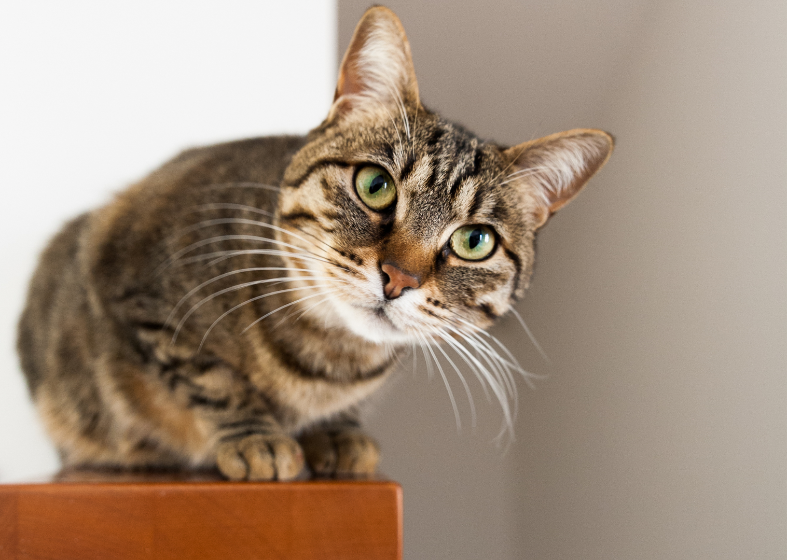
  Початковий розмір: 1517 х 1080  
  Формат: PNG  
  Вага файлу: 2.4 Мб  

* Скріншот
  
  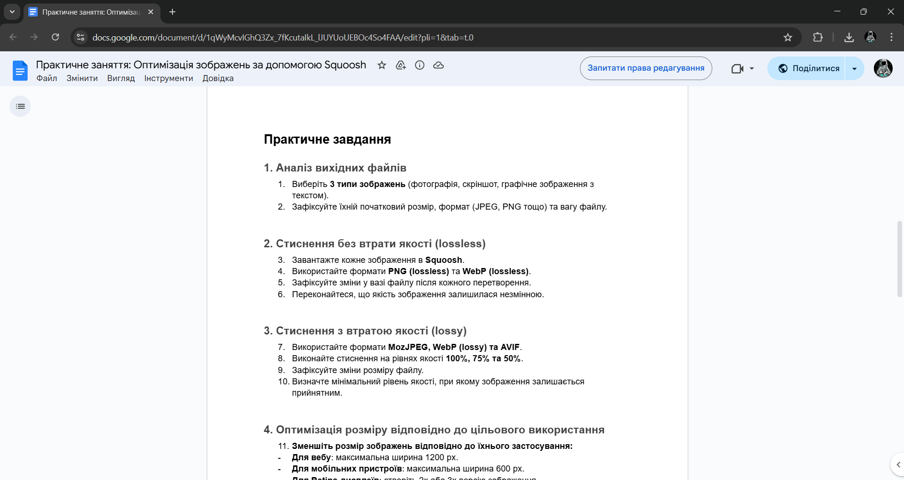
  Початковий розмір: 1919 х 1019  
  Формат: PNG  
  Вага файлу: 199 Кб  

* Графічне зображення з текстом
  
  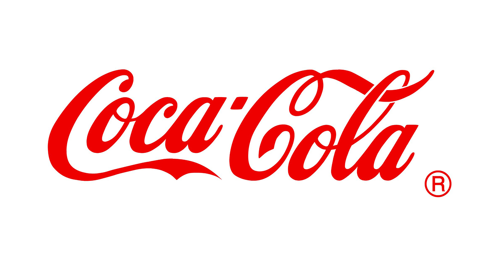
  Початковий розмір: 1165 х 612  
  Формат: JPEG  
  Вага файлу: 224 Кб  

**Стиснення без втрати якості (lossless)**
1. PNG (lossless)
   * Фотографія

     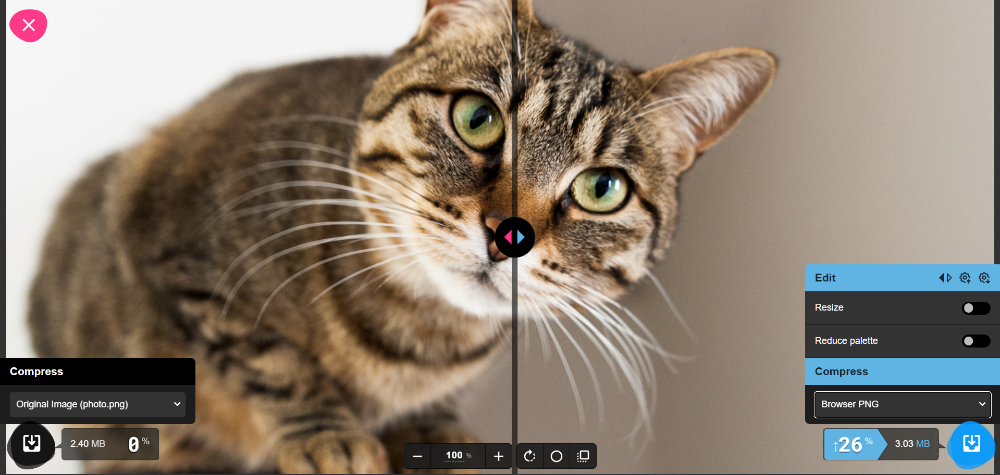
     Після перетворення, вага зображення зросла до 3.03 Мб.  
     Якість зображення залишилася незмінною.
     
   * Скріншот
   
     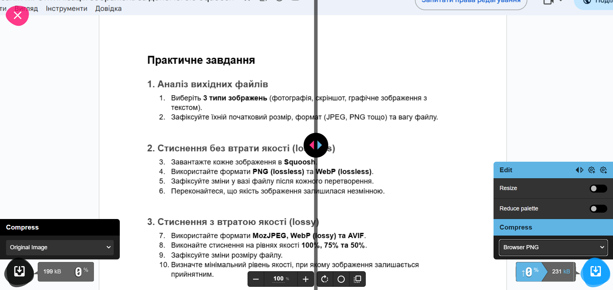
     Після перетворення, вага зображення зросла до 231 Кб.  
     Якість зображення залишилася незмінною.
       
   * Графічне зображення з текстом
   
     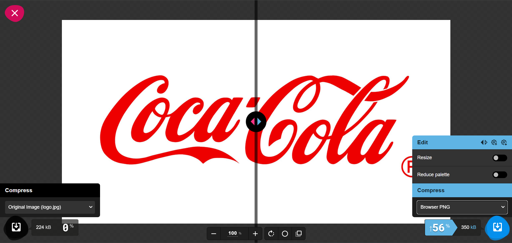
     Після перетворення, вага зображення зросла до 350 Кб.  
     Якість зображення залишилася незмінною.
     
2. WebP (lossless)
   * Фотографія

     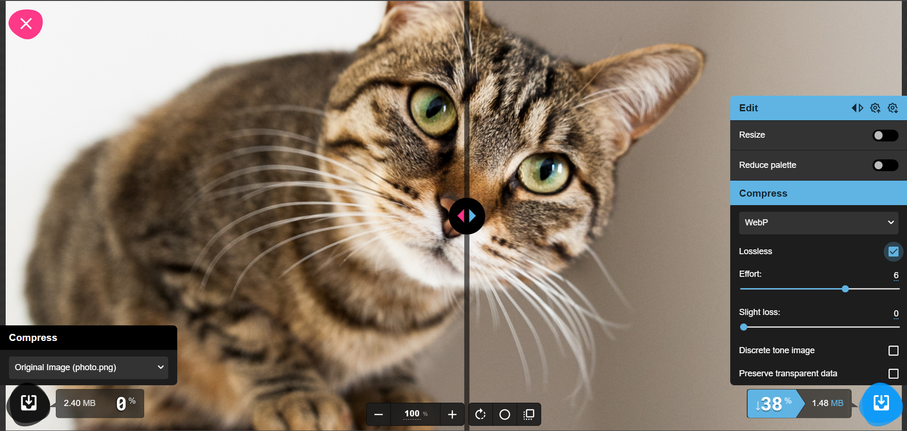
     Після перетворення, вага зображення зменшилася до 1.48 Мб.  
     Якість зображення залишилася незмінною.  

    * Скріншот

      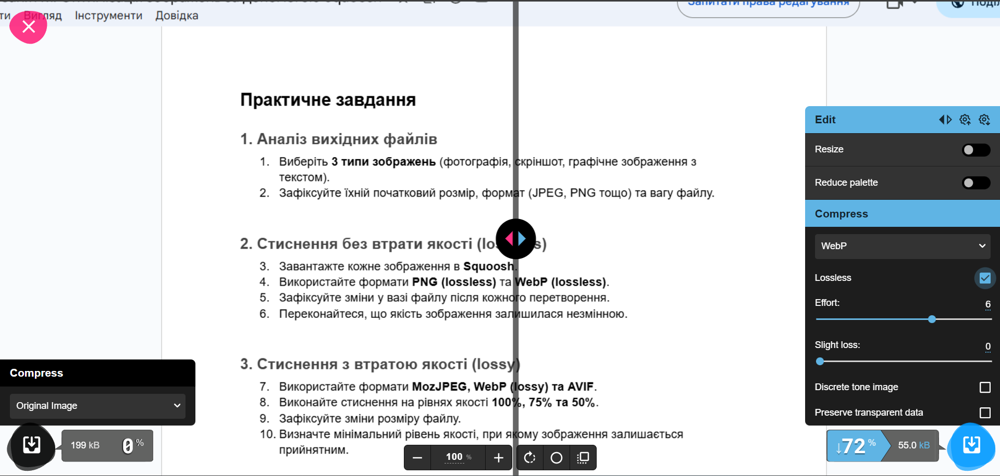
      Після перетворення, вага зображення зменшилася до 55 Кб.  
      Якість зображення залишилася незмінною.
      
   * Графічне зображення з текстом
   
     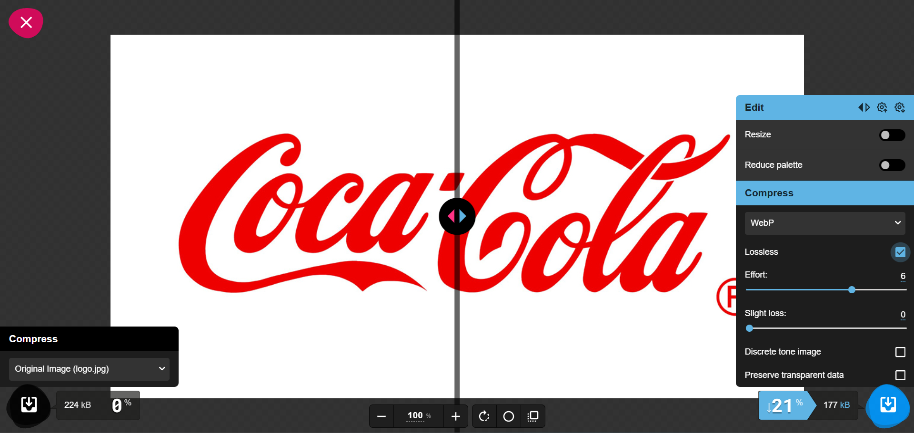
     Після перетворення, вага зображення зменшилася до 177 Кб.  
     Якість зображення залишилася незмінною.
     
**Стиснення з втратою якості (lossy)**
1. MozJPEG
   * Фотографія

     
     Після стиснення на рівні якості 100%, вага зображення зменшилася до 1.16 Мб.
     
     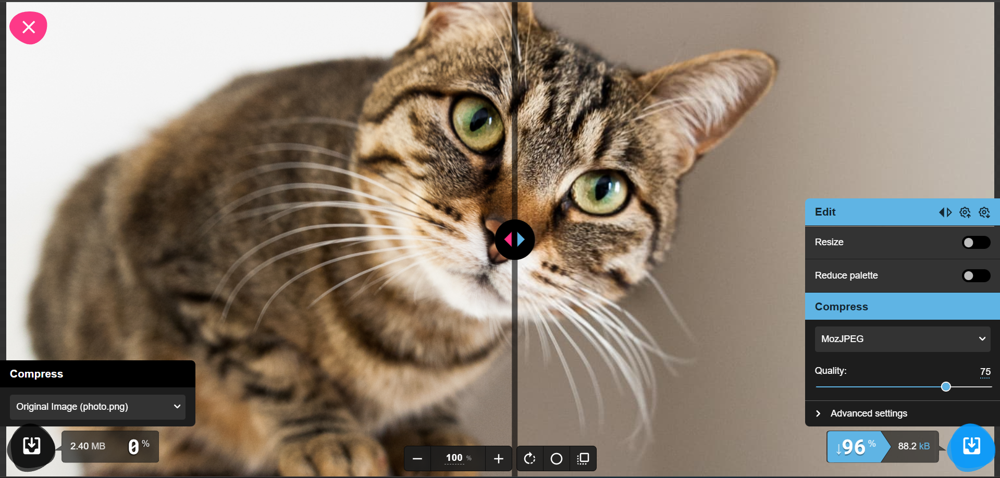
     Після стиснення на рівні якості 75%, вага зображення зменшилася до 88.2 Кб.
     
     
     Після стиснення на рівні якості 50%, вага зображення зменшилася до 52.1 Кб.

     
     На мою думку, мінімальний рівень якості, при якому зображення залишається прийнятним - 35%. Оскільки дозволяє досягти максимальної економії обсягу файлу (40.6 Кб), зберігаючи при цьому достатній рівень візуальної прийнятності та деталізації для перегляду на вебресурсах.

    * Скріншот

      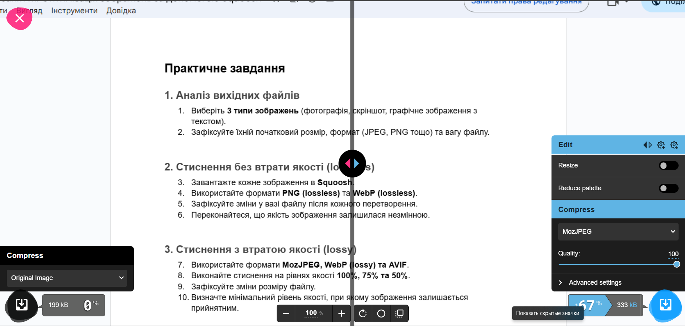
      Після стиснення на рівні якості 100%, вага зображення зросла до 333 Кб.

      
      Після стиснення на рівні якості 75%, вага зображення зменшилася до 100 Кб.

      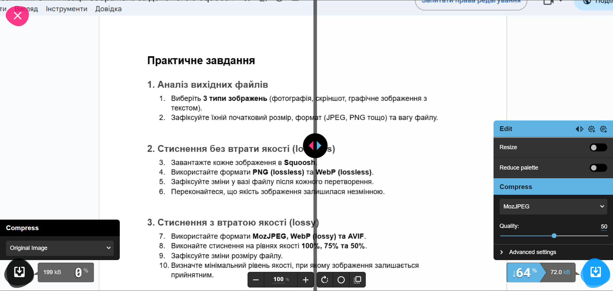
      Після стиснення на рівні якості 50%, вага зображення зменшилася до 72 Кб.

      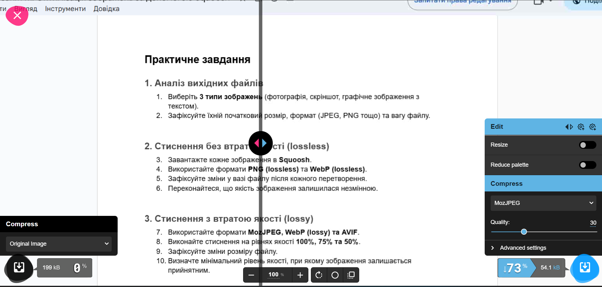
      На мою думку, мінімальний рівень якості, при якому зображення залишається прийнятним - 30%. Це рівень, де скорочення розміру файлу залишається максимальним (54.1 Кб) при мінімально допустимому погіршенні візуальної якості.
   
    * Графічне зображення з текстом

      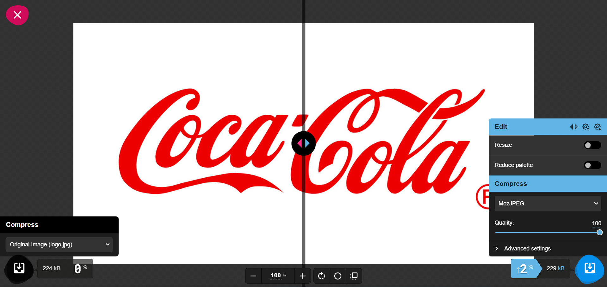
      Після стиснення на рівні якості 100%, вага зображення зросла до 229 Кб.

      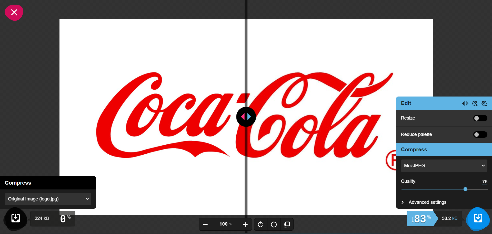
      Після стиснення на рівні якості 75%, вага зображення зменшилася до 38.2 Кб.

      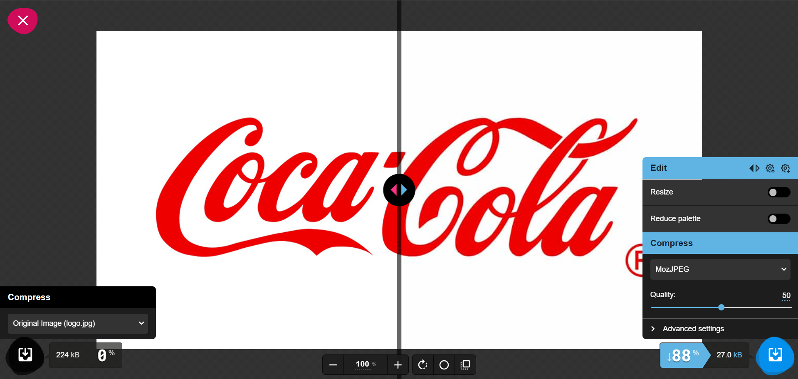
      Після стиснення на рівні якості 50%, вага зображення зменшилася до 27 Кб.  
      На мою думку, це мінімальний рівень якості, при якому зображення залишається прийнятним. Цей поріг дозволяє отримати максимально стиснений файл, зберігаючи при цьому відсутність різких візуальних дефектів.
      
3. WebP (lossy)
   * Фотографія

     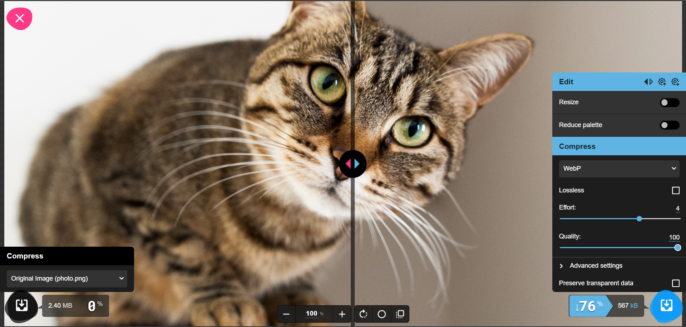
     Після стиснення на рівні якості 100%, вага зображення зменшилася до 567 Кб.
     
     
     Після стиснення на рівні якості 75%, вага зображення зменшилася до 67.7 Кб.
     
     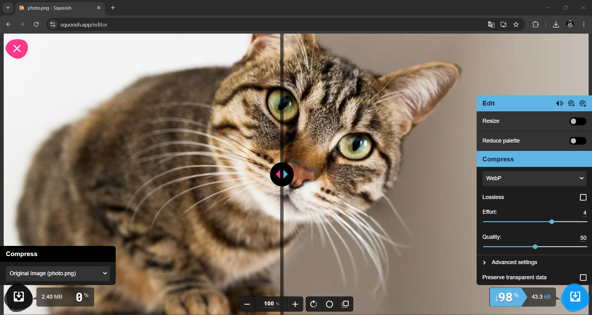
     Після стиснення на рівні якості 50%, вага зображення зменшилася до 43.3 Кб.

     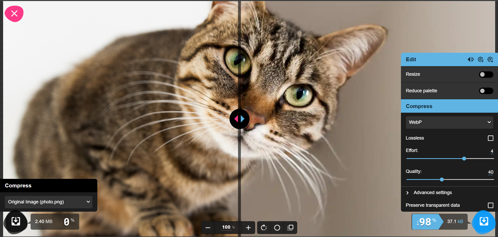
     На мою думку, мінімальний рівень якості, при якому зображення залишається прийнятним - 40%. Такий показник дає змогу досягти максимальної економії обсягу файлу (37.1 Кб), оскільки подальше зниження якості вже призводить до надмірного погіршення деталей та появи помітних артефактів, які візуально неприйнятні для користувача.

    * Скріншот

      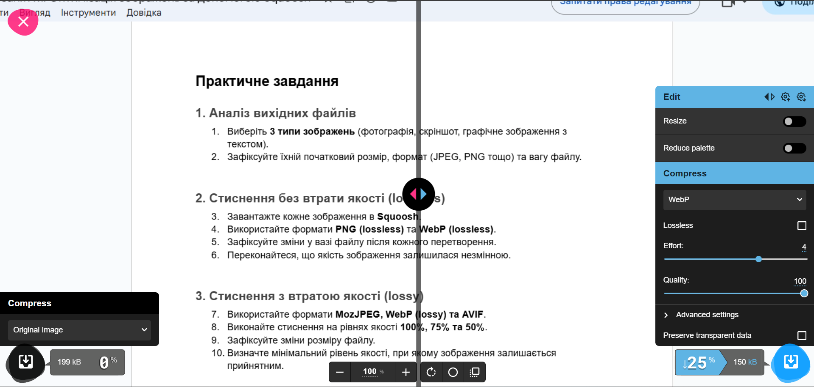
      Після стиснення на рівні якості 100%, вага зображення зменшилася до 150 Кб.

      
      Після стиснення на рівні якості 75%, вага зображення зменшилася до 79 Кб.

      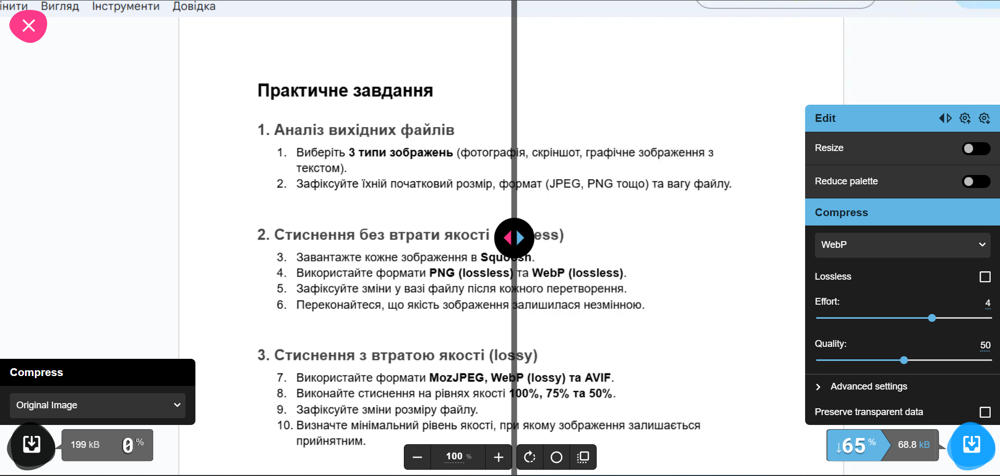
      Після стиснення на рівні якості 50%, вага зображення зменшилася до 68.8 Кб.

      
      На мою думку, мінімальний рівень якості, при якому зображення залишається прийнятним - 10.3%. Він забезпечує ефективну оптимізацію, коли файл стає набагато меншим ( Кб), проте залишається достатньо деталізованим.
      
    * Графічне зображення з текстом

      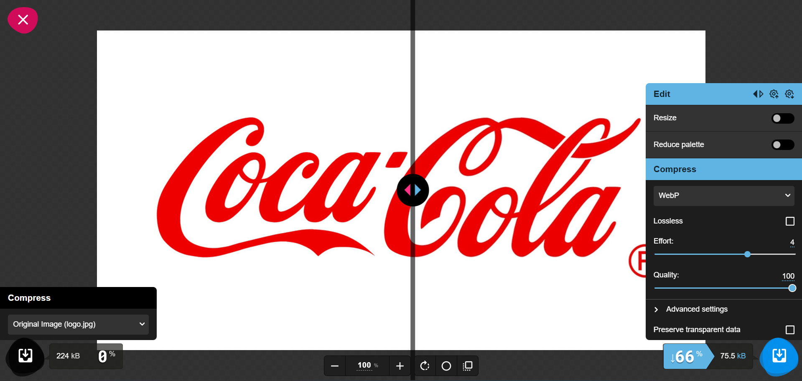
      Після стиснення на рівні якості 100%, вага зображення зменшилася до 75.5 Кб.

      
      Після стиснення на рівні якості 75%, вага зображення зменшилася до 26.9 Кб.

      
      Після стиснення на рівні якості 50%, вага зображення зменшилася до 22.2 Кб.
  
        
      На мою думку, мінімальний рівень якості, при якому зображення залишається прийнятним - 35%. Це зберігає достатню інформативну цінність зображення та його основну деталізацію, водночас зменшуючи його фізичний розмір (18.8 Кб).
      
5. AVIF
   * Фотографія

     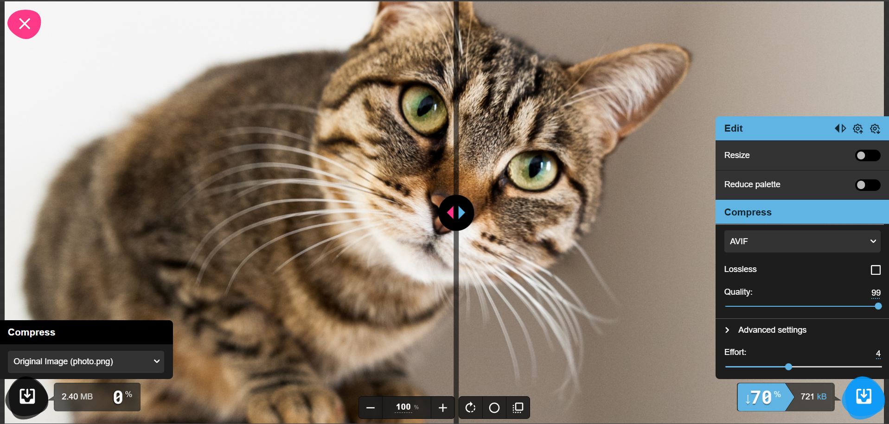
     Після стиснення на рівні якості 99%, вага зображення зменшилася до 721 Кб.
     
     
     Після стиснення на рівні якості 75%, вага зображення зменшилася до 135 Кб.
     
     
     Після стиснення на рівні якості 50%, вага зображення зменшилася до 29.8 Кб.

     
     На мою думку, мінімальний рівень якості, при якому зображення залишається прийнятним - 28%. Вона дозволяє досягти значного зменшення ваги файлу (13.6 Кб), водночас зберігаючи деталізацію на рівні, достатньому для комфортного сприйняття кінцевим користувачем.
     
   * Скріншот

     
     Після стиснення на рівні якості 99%, вага зображення зменшилася до 153 Кб.
     
     
     Після стиснення на рівні якості 75%, вага зображення зменшилася до 86.9 Кб.
     
     
     Після стиснення на рівні якості 50%, вага зображення зменшилася до 62.1 Кб.

     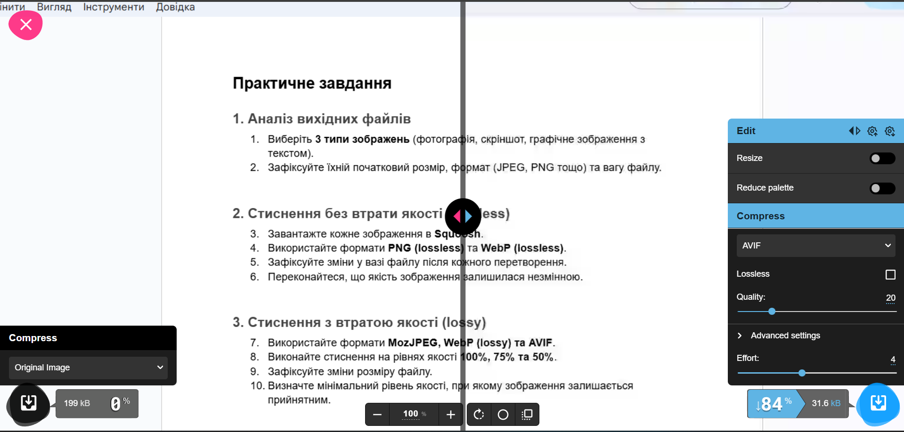
     На мою думку, мінімальний рівень якості, при якому зображення залишається прийнятним - 20%. Оскільки це та межа, за якою економія обсягу файлу стає найбільшою (31.6 Кб), а візуальні втрати залишаються контрольованими.
       
    * Графічне зображення з текстом

      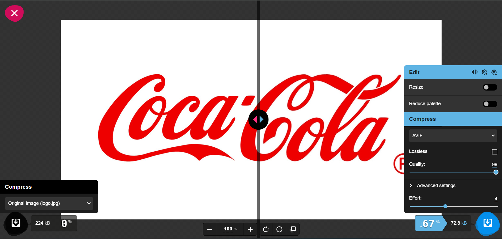
      Після стиснення на рівні якості 99%, вага зображення зменшилася до 72.8 Кб.

      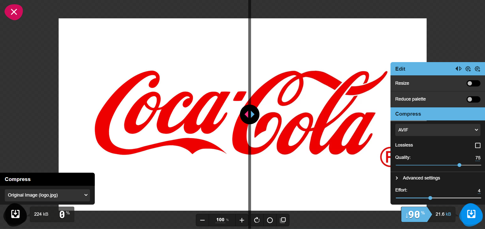
      Після стиснення на рівні якості 75%, вага зображення зменшилася до 21.6 Кб.

      
      Після стиснення на рівні якості 50%, вага зображення зменшилася до 12 Кб.
  
        
      На мою думку, мінімальний рівень якості, при якому зображення залишається прийнятним - 30%. Це оптимальний баланс між малим розміром файлу (6.36 Кб) та збереженням природного візуального вигляду зображення.

**Оптимізація розміру відповідно до цільового використання**
1. Для вебу (максимальна ширина 1200 px)
   * Фотографія

     
     Після перетворення, розмір зображення став 1200 х 854, а вага - 324 Кб.  
     
   * Скріншот
   
     
     Після перетворення, розмір зображення став 1200 х 637, а вага - 85.7 Кб.
       
   * Графічне зображення з текстом
   
     
     Після перетворення, розмір зображення став 1200 х 630, а вага - 84.6 Кб.
     
2. Для мобільних пристроїв (максимальна ширина 600 px)
   * Фотографія

     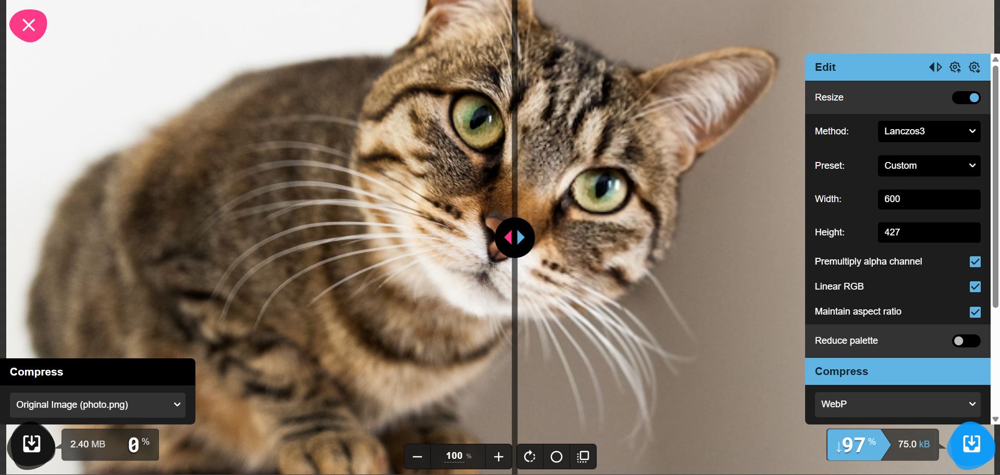
     Після перетворення, розмір зображення став 600 х 427, а вага - 75 Кб.  
     
   * Скріншот
   
     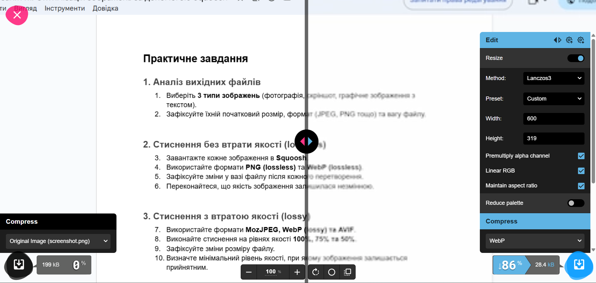
     Після перетворення, розмір зображення став 600 х 319, а вага - 28.4 Кб.
       
   * Графічне зображення з текстом
   
     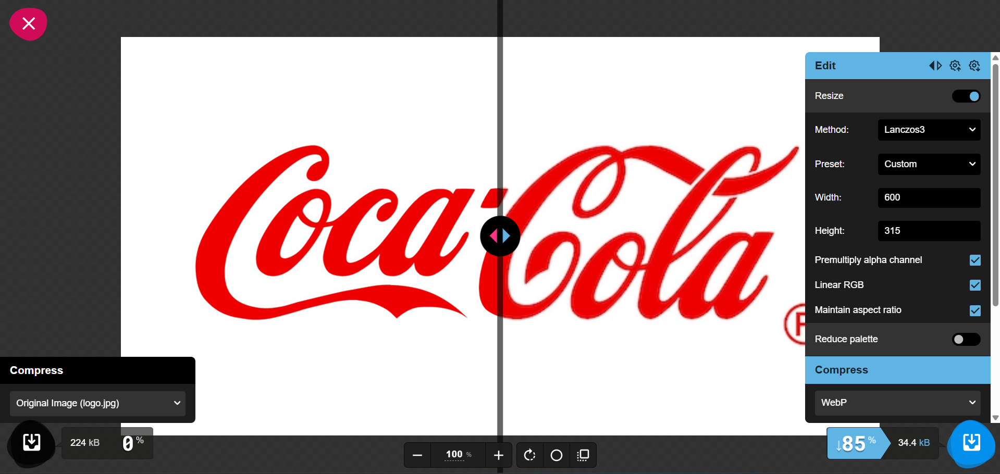
     Після перетворення, розмір зображення став 600 х 315, а вага - 34.4 Кб.
     
3. Для Retina-дисплеїв (2x або 3x версія зображення)
   * Фотографія

     
     Після перетворення, розмір зображення став 1800 х 1281, а вага - 721 Кб.  
     
   * Скріншот
   
     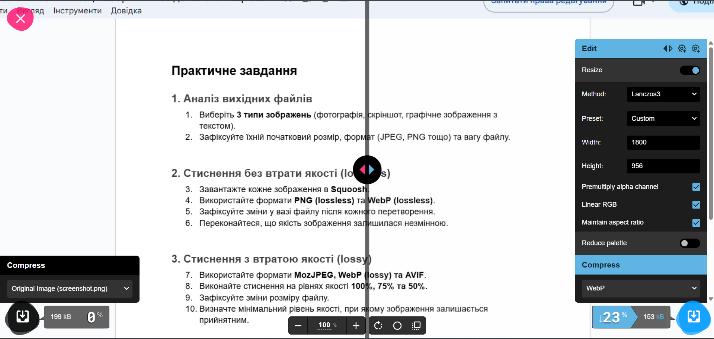
     Після перетворення, розмір зображення став 1800 х 956, а вага - 153 Кб.
       
   * Графічне зображення з текстом
   
     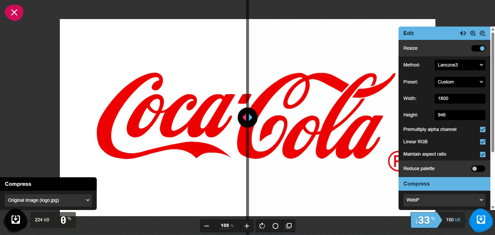
     Після перетворення, розмір зображення став 1800 х 946, а вага - 150 Кб.
     
### Висновки
Робота з трьома різними типами зображень підтвердила, що ефективність стиснення залежить не лише від обраного інструменту, але й від правильного підбору формату та параметрів якості відповідно до контенту зображення.  

Для фотографій зі складною колірною палітрою найбільш ефективним є формат AVIF (lossy), оскільки він забезпечує найвищий коефіцієнт стиснення (до 99%) порівняно з PNG та WebP, зберігаючи при цьому необхідну візуальну прийнятність. Натомість, для скріншотів, де важлива чіткість тексту та мінімізація артефактів на однотонних областях, оптимальним вибором є WebP (Lossless), який дозволяє зменшити розмір файлу на 72% без втрати якості. А для графічних зображень з векторними елементами, AVIF (Lossy), навіть при якості 30, також виявився найкращим, показавши виняткову ефективність, дозволивши зменшити вагу файлу на 97% (до 6.36 Кб).    

Також важливим етапом оптимізації є зміна розміру зображення відповідно до цільового використання. Аналіз підтвердив, що зменшення розміру від вихідного до цільового (наприклад, 600 px для мобільних пристроїв) призводить до найбільш значного скорочення ваги файлу. Цей крок є фундаментальним, оскільки він усуває надлишкове навантаження на мережу та потужності браузера, необхідні для масштабування.

Для забезпечення високої якості зображень на екранах із підвищеною щільністю пікселів (Retina) потрібна правильна адаптація. Це досягається подачею версій зображень із більшою роздільною здатністю, що неминуче збільшує вагу файлу. Тому впровадження має відбуватися за допомогою адаптивних методів, таких як атрибут srcset. Цей інструмент дозволяє браузеру самостійно вибрати найбільш відповідний розмір зображення, подаючи версію з високою роздільною здатністю лише користувачам із відповідними пристроями, що забезпечує як якість, так і швидкість завантаження для всіх користувачів.   

Результати роботи вказують на перевагу сучасних форматів AVIF та WebP над традиційними JPEG та PNG. Для досягнення максимальної швидкості завантаження та високої візуальної якості важливо поєднувати три основні стратегії: вибір оптимального формату, контрольоване стиснення з втратами та адаптацію фізичного розміру відповідно до цільового пристрою.
