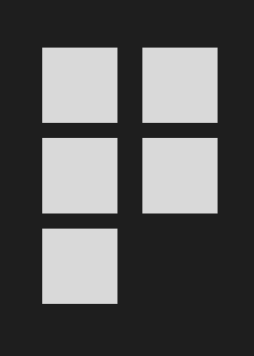
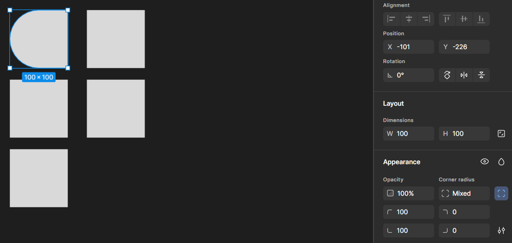
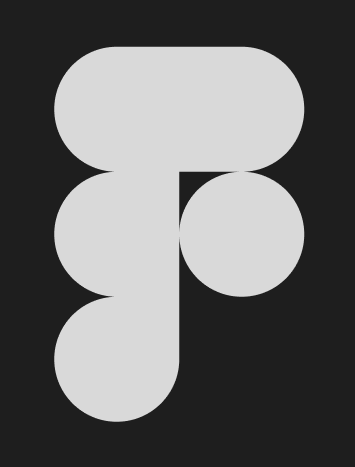
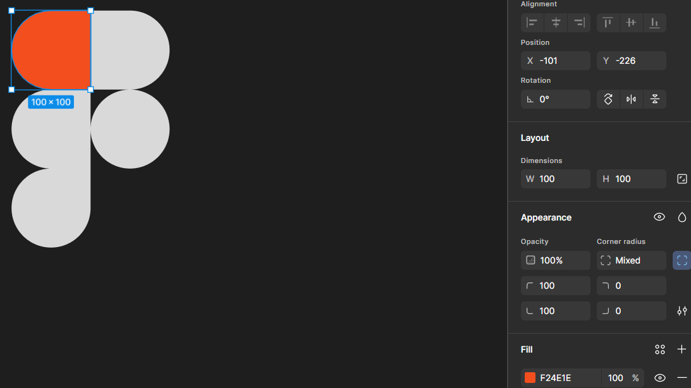
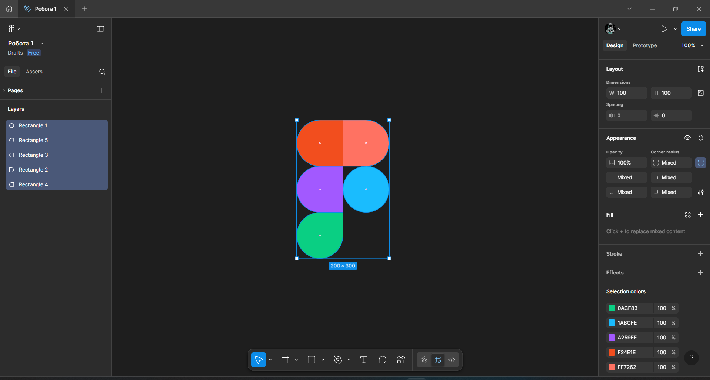
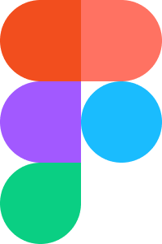

# Практична робота 2
## Робота з простими формами та їх властивостями у Figma. Частина 1

### Хід роботи  
**Створення зображення за зразком, використовуючи просту форму (shape tool) Rectangle.**  
1. *Додавання за допомогою інструмента Rectangle (R) кількох квадратів однакового розміру. Нижче знімок екрану робочої області Figma.*

   

2. *Cкруглення кутів фігур. Нижче знімок екрану робочої області Figma.*

   

3. *Розміщення фігур у правильній послідовності для утворення логотипу Figma. Нижче знімок екрану робочої області Figma.*

   

4. *Задання фігурам кольорів. Нижче знімок екрану робочої області Figma.*

   
   
5. *Створений логотип Figma на основі Rectangle. Нижче знімок екрану робочої області Figma.*

   

   *Та фото виконаної роботи.*  
   

### Висновки
В ході виконання практичної роботи було створено логотип Figma з використанням базового інструменту Rectangle. В результаті я дізнався як використовувати можливості Figma для створення проектів використвовуючи прості геометричні фігури.
