# Практична робота 3
## Робота з простими формами та їх властивостями у Figma. Створення геометричного візерунку. Частина 2  

### Хід роботи  
**Створиення фрагментів геометричних візерунків використовуючи прості фігури та їх властивості в сервісі Figma.** 
1. *Створення базової площини. Нижче знімок екрану робочої області Figma.*

   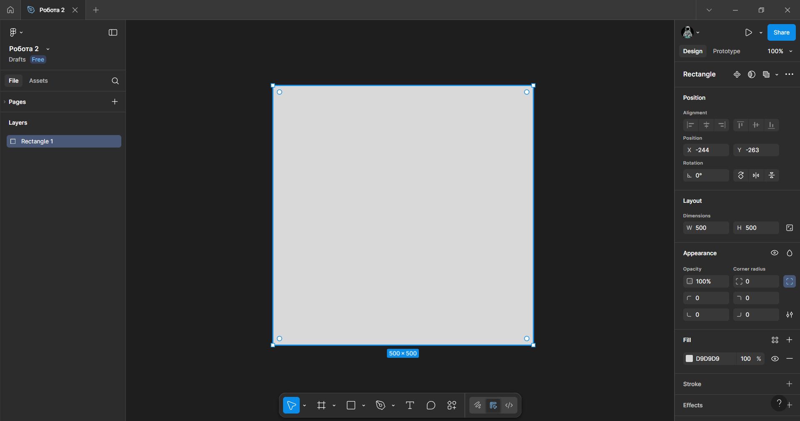

2. *Попереднє додання фону на початкову основу. Нижче знімки екрану робочої області Figma.*

   *Візерунок №1*
   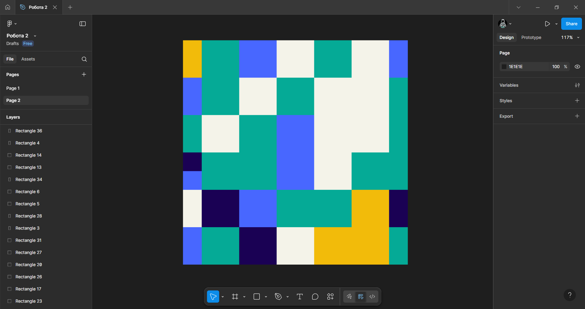

   *Візерунок №2*
   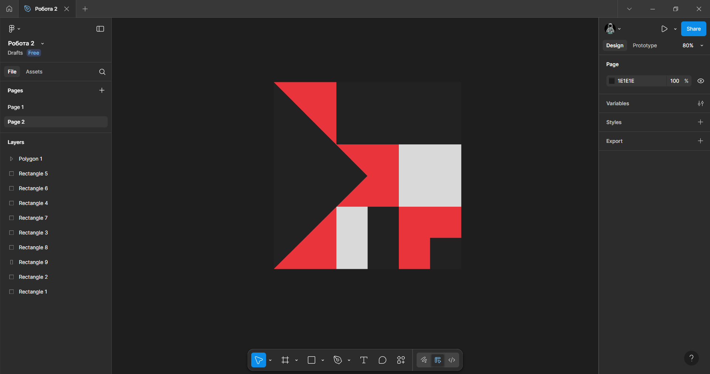

   *Візерунок №3*
   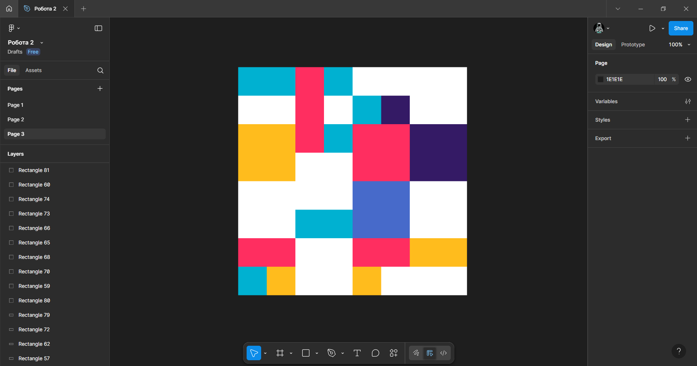

3. *Додавання деталей використовуючи прості фігури як: круги, трикутники та квадрати. Нижче знімки екрану робочої області Figma.*

   *Візерунок №1*
   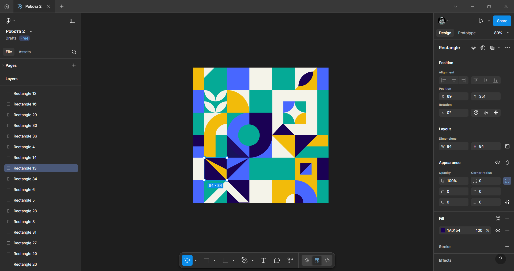

   *Візерунок №2*
   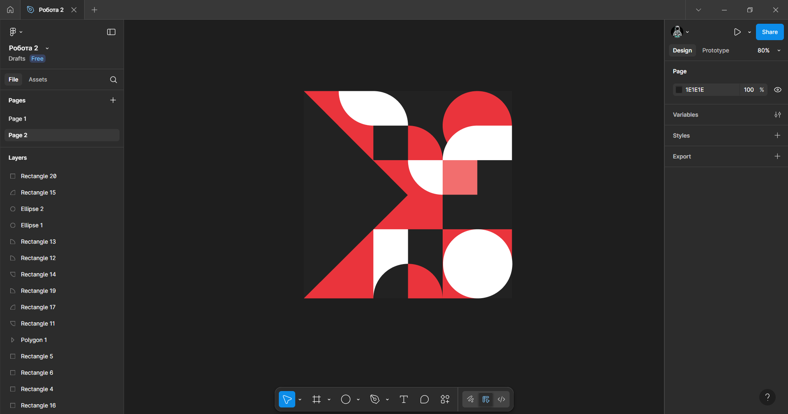

   *Візерунок №3*
   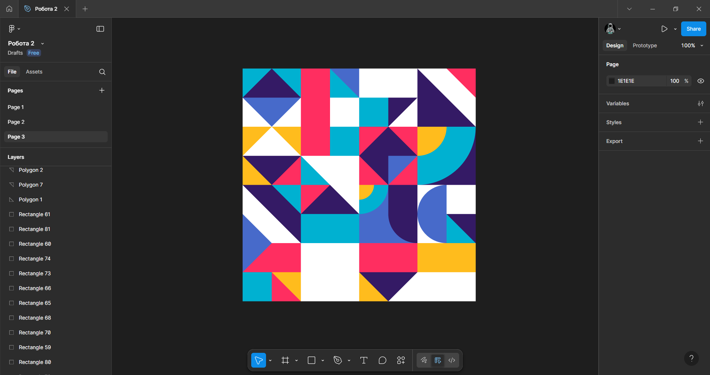
   
4. *Кінцеві результати. Нижче знімки екрану робочої області Figma.*

   *Візерунок №1*
   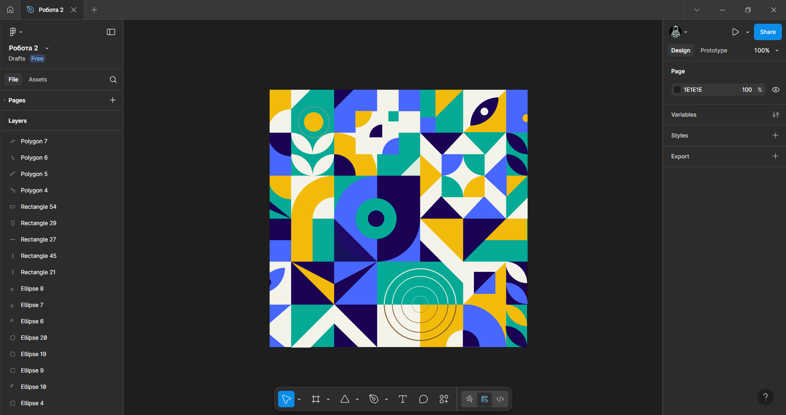

   *Візерунок №2*
   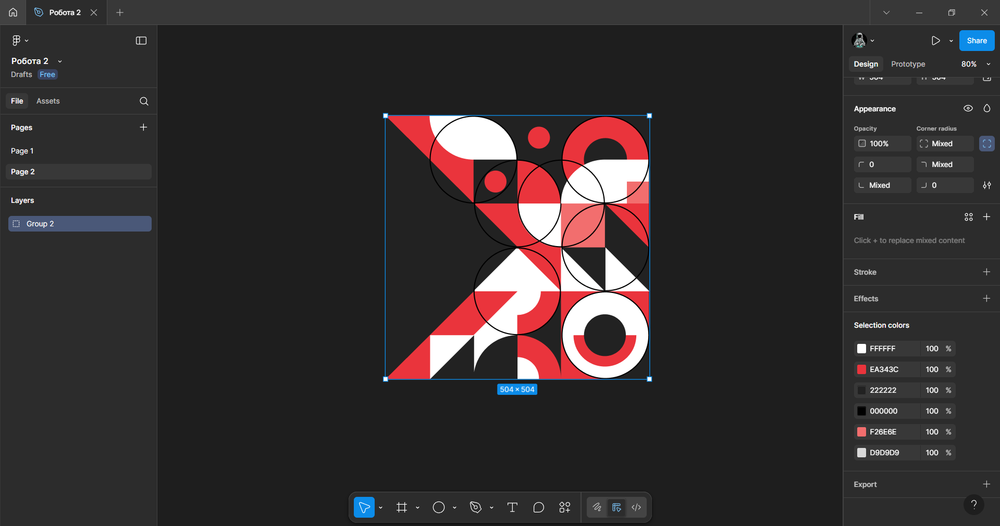

   *Візерунок №3*
   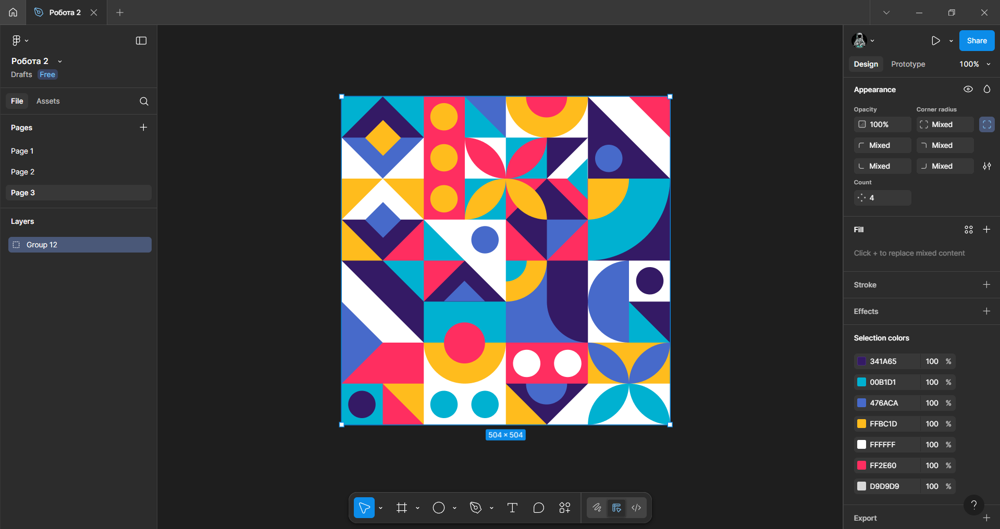

   *Та фото виконаних робіт.*  

   *Візерунок №1*  
   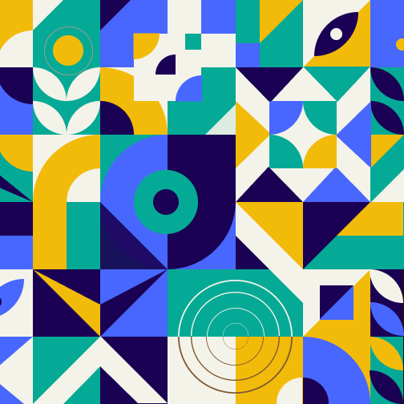

   *Візерунок №2*  
   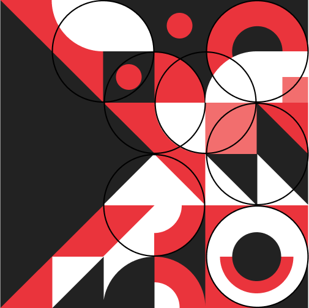

   *Візерунок №3*  
   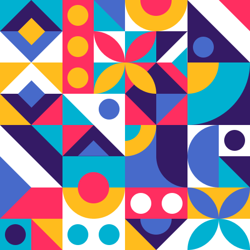

   *Nf djr* 
   https://www.figma.com/design/Rpi0MWt2GeFyX6MSiIIHTP/%D0%A0%D0%BE%D0%B1%D0%BE%D1%82%D0%B0-2?node-id=8-646&t=yJVWJLFmvql4Skeb-1

### Висновки
В ході виконання практичної роботи було створено візерунки з використанням простих фігур. В результаті я розширив свої знання, як використовувати можливості Figma для створення проектів на основі простих геометричних фігур, таких як: трикутники, круги та квадрати.
