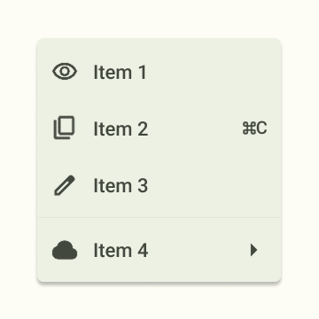
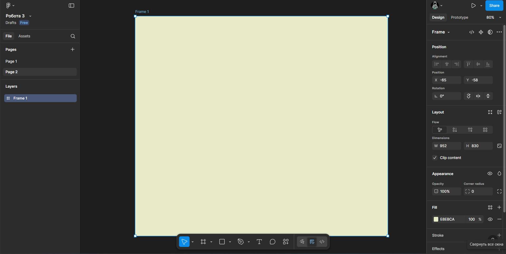
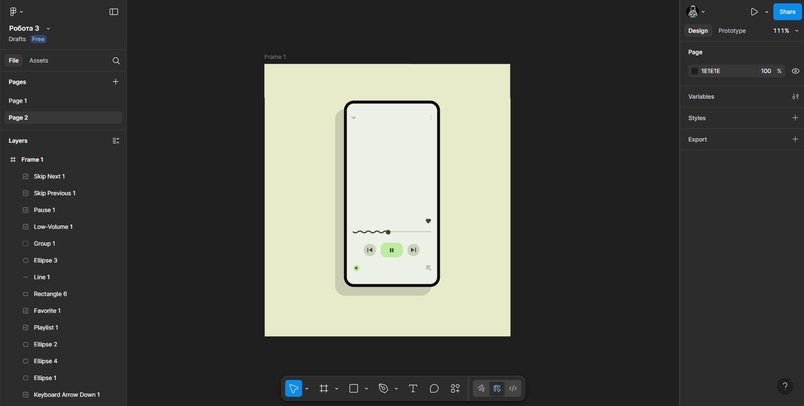

# Практична робота 4
## Фрейми, групи і секції у Figma  

### Хід роботи  
**Відтворення завдання за зразком.**   

**Basic**
1. *Створення фрейму. Нижче знімок екрану робочої області Figma.*

   

2. *Створення каркасу, та додавання на нього іконок, взятих з [Google Fonts](https://fonts.google.com/icons). Нижче знімок екрану робочої області Figma.*

   

3. *Додавання тексту. Нижче знімок екрану робочої області Figma.*

   

   *Фото виконаної роботи.*

   

**Medium**
1. *Створення фрейму. Нижче знімок екрану робочої області Figma.*

   

2. *Додавання іконок, взятих з [Google Fonts](https://fonts.google.com/icons) та [Flaticon](https://www.flaticon.com/) на фонову розмітку під телефон. Нижче знімок екрану робочої області Figma.*

   

3. *Додавання тексту та фотографії, подібної прикладу, взятої з [Unsplash](https://unsplash.com/). Нижче знімок екрану робочої області Figma.*

   

   *Фото виконаної роботи.*

   

   *Та сама робота.*   
   [Basic/Medium](https://www.figma.com/design/K4hVdx36jflxo6aWHuJSPY/%D0%A0%D0%BE%D0%B1%D0%BE%D1%82%D0%B0-3?node-id=10-2&t=GIvgOA5Duzsks5r2-1)

### Висновки
В ході виконання практичної роботи було відтворено завдання за зразком, рівнів Basic та Medium, з незначною зміною графіки в роботі Medium. В результаті я розширив свої знання, про можливості роботи у Figma та дізнався про такий інструмент як фрейм та як з ним працювати.
