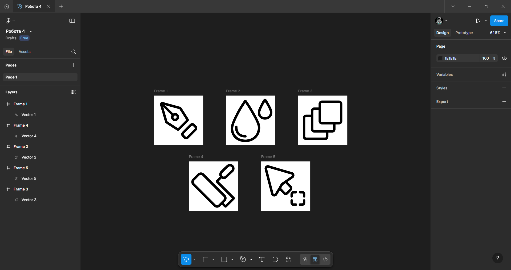

# Практична робота 5
## Криві Безьє, векторні об'єкти  у Figma. Створення векторних значків (іконок)

### Хід роботи  
**Створення  п'яти іконок у border (обводочному) стилі.**   
1. *Створення індивідуальних фреймів 24 на 24 для кожної іконки. Нижче знімок екрану робочої області Figma.*
   
   

2. *Створення іконок за допомогою кривих Безьє, використовуючи інструмент Pen Tool. Нижче знімки екрану робочої області Figma.*

   *Іконка №1*  
   

   *Іконка №2*  
   

   *Іконка №3*  
   

   *Іконка №4*  
   

   *Іконка №5*  
   

3. *Кінцевий результат. Нижче знімок екрану робочої області Figma.*

   

   *Фото виконаних робіт.*  

   *Іконка №1*  
   

   *Іконка №2*  
   

   *Іконка №3*  
   

   *Іконка №4*  
   

   *Іконка №5*  
   

   *Та сама робота.*   
   [Іконки](https://www.figma.com/design/333f4sFfhuz8n6Ma9di4vd/%D0%A0%D0%BE%D0%B1%D0%BE%D1%82%D0%B0-4?node-id=0-1&t=pqcGShnzkfPBF54I-1)

### Висновки
В ході виконання практичної роботи було створено декілька іконок використовуючи інструмент Pen Tool у Figma. В результаті я засвоїв принцип побудови кривих Безьє за допомогою цього інструменту, що дозволяє точно формувати контури та плавні лінії в подальших проєктах.
