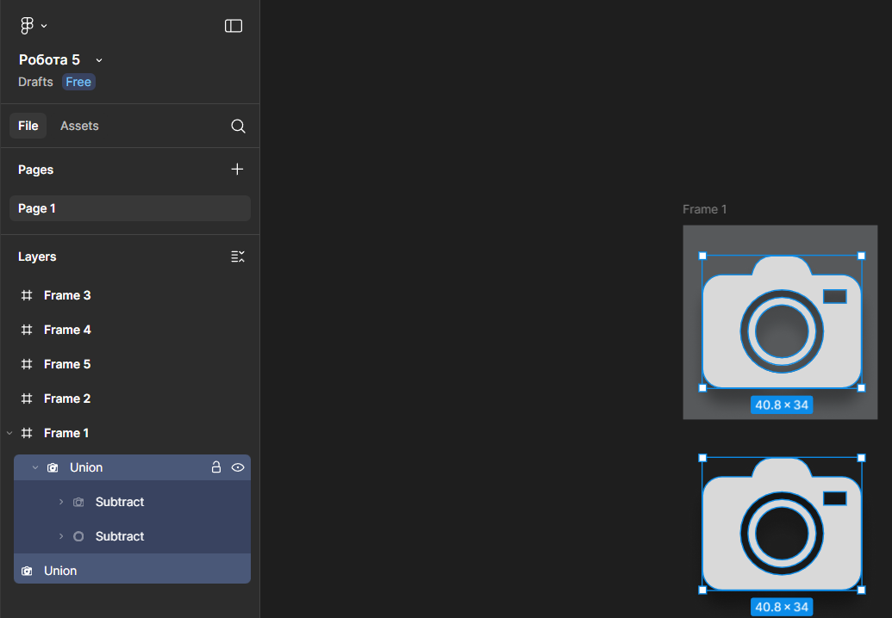

# Практична робота 6
## Булеві групи і флетен у Figma

### Хід роботи  
**Створення значків у заливковому стилі (solid), використовуючи булеві групи.**  
1. *Створення індивідуальних фреймів для кожного значка. Нижче знімок екрану робочої області Figma.*
   
   

2. *Після створення кожний з значків, був окремо винесений та перетворений в єдиний векторний об’єкт. Нижче знімок екрану робочої області Figma з прикладом.*

   

3. *Кінцевий результат. Нижче знімок екрану робочої області Figma.*

   

   *Фото виконаних робіт.*  

   *Іконка №1*  
   

   *Іконка №2*  
   

   *Іконка №3*  
   

   *Іконка №4*  
   

   *Іконка №5*  
   

   *Іконка №6*  
   

   *Та сама робота.*   
   [Іконки](https://www.figma.com/design/uKQYaIufWtDiFk8GCRkSjW/%D0%A0%D0%BE%D0%B1%D0%BE%D1%82%D0%B0-5?node-id=0-1&t=U0vWztAsSFwms5YW-1)

### Висновки
В ході виконання практичної роботи було створено декілька значків використовуючи булеві групи (Union, Subtract, Intersect, Exclude). Та використовуючи команду Flatten перетворено їх з складених булевих груп у єдині векторні об’єкти. В результаті я навчився поєднувати фігури для створення складних форм і перетворювати їх у єдиний векторний об’єкт.
