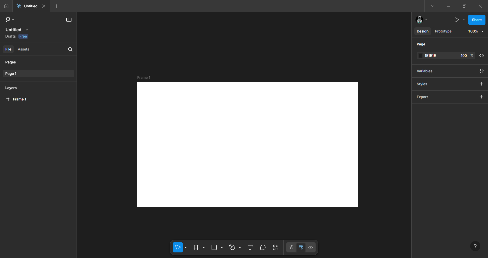
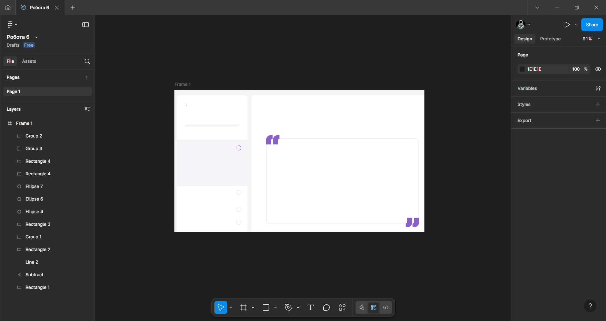
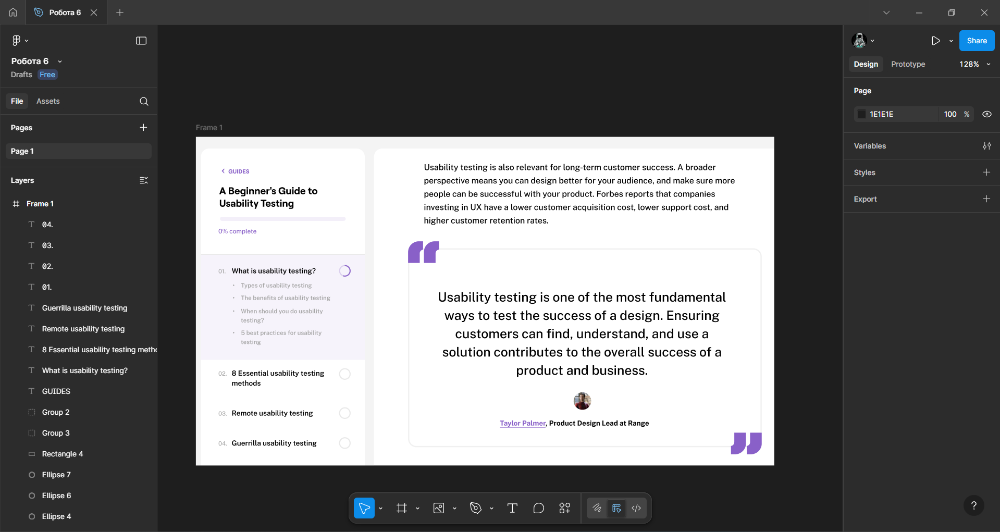

# Практична робота 7-8
## Типографіка  в дизайні користувальницького інтерфейсу

### Хід роботи  
**Частина 1:**  
*У цій частині було опрацьовано теоретичний матеріал про типографіку. Про види шрифтів, основні поняття, такі як: кегель, інтерліньяж, кернінг, трекінг та правила вибору шрифтів для зручності читання й естетичності дизайну.*

**Частина 2:**  
*У цій частині було закріплено попередній теоретичний матеріал на практиці. А саме, відтворено частину вебсторінки, за зразком.*
1. *Створення загального полотна, за допомогою фрейма. Нижче знімок екрану робочої області Figma.*
   
   

2. *Додавання фонових графічних елементів. Нижче знімок екрану робочої області Figma.*

   

3. *Кінцевий результат, після додавання тексту. Відповідні шрифти було взято з сайту [Google Fonts](https://fonts.google.com/?authuser=0). А сам текст з [Maze](https://maze.co/guides/usability-testing/#benefits). Нижче знімок екрану робочої області Figma.*

   

   *Фото виконаної роботи.*   
   

   *Та сама робота.*  
   [Вебсторінка](https://www.figma.com/design/jC1LOdtneVnOinldxQi7D0/%D0%A0%D0%BE%D0%B1%D0%BE%D1%82%D0%B0-6?node-id=3-2&t=uvv07Cl1tmERsAis-1)

### Висновки
В ході виконання практичної роботи, з двух частин, було опрацьовано теоретичний матеріал з теми «Типографіка» та закріплено його на практиці у середовищі Figma. Було відтворено частину вебсторінки Maze. Я дізнався як добирати й поєднувати шрифти, налаштовувати текстові стилі та ієрархію, і зрозумів наскільки це важливо при розробці користувальницького інтерфейсу.
