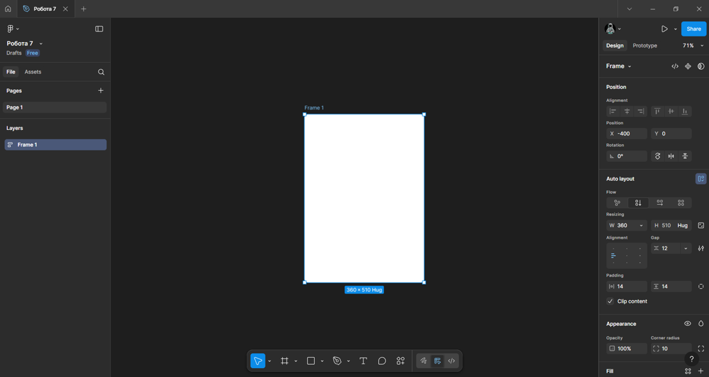
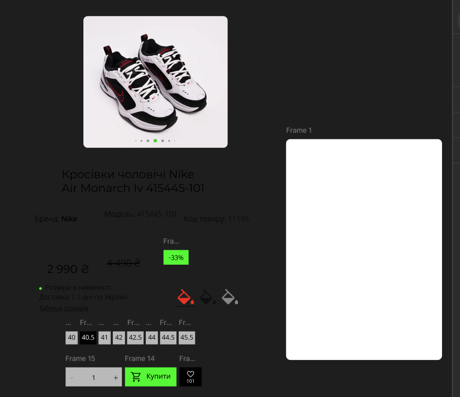
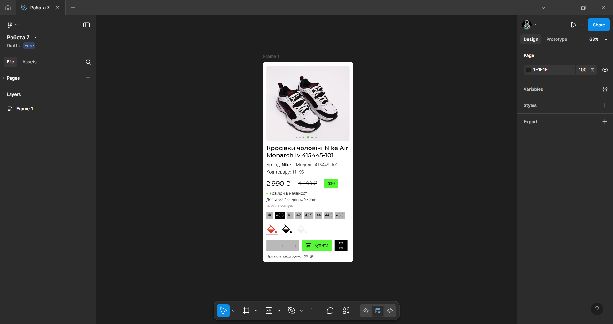
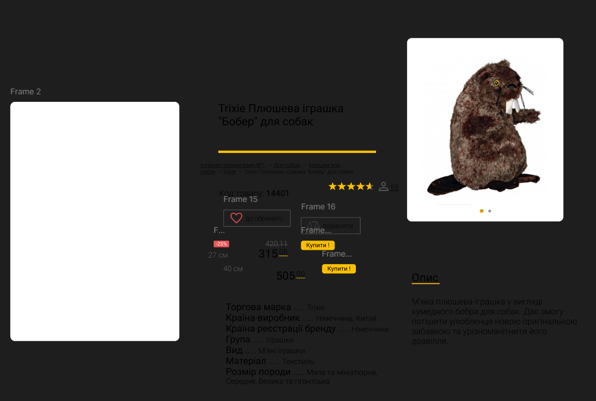
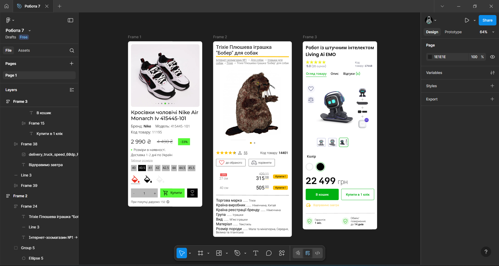

# Практична робота 9
## Функція Auto Layout у Figma. Створення картки товару (послуги)

### Хід роботи  
**Створення малої картки товару, використовуючи функцію Auto layout у Figma.**  
1. *Створення фрейму та налаштування Auto Layout для картки товару. Нижче знімок екрану робочої області Figma.*
   
   

2. *Створення/додавання необхідних елементів для подальшого формування малої картки товару. (зображення, текст, значки). Нижче знімок екрану робочої області Figma.*   
   Основу для картки взято з сайту [Yes, Original](https://yesoriginal.com.ua/uk/krossovki-muzhskie-nike-air-monarch-iv-415445-101). Зображення товару та текстові дані були взяті безпосередньо з нього ж. Значки імпортовані з бібліотеки [Google Fonts](https://fonts.google.com/icons).

   

3. *Фінальна збірка елементів та завершення дизайну картки товару. Нижче знімок екрану робочої області Figma.*

   

**Створення додаткових карток товарів, використовуючи функцію Auto layout у Figma.** 
1. *Створення/додавання необхідних елементів для подальшого формування другої картки товару. (зображення, текст, значки). Нижче знімок екрану робочої області Figma.*   
   Основу для цієї картки взято з сайту [Pethouse](https://pethouse.ua/ua/shop/sobakam/igrushki/trixie/trixie-plyushevaya-igrushka-bober-dlya-sobak/?utm_source=google&utm_medium=cpc&utm_campaign=DSA_%D0%A1%D0%BE%D0%B1%D0%B0%D0%BA%D0%B8_geo_%D0%A3_ukr&utm_id=19180712862&utm_content=145055828635&utm_term=&utm_creative=737879941323&utm_matchtype=&utm_device=m&utm_network=g&utm_placement=&utm_adposition=&gad_source=1&gad_campaignid=19180712862&gclid=CjwKCAiAoNbIBhB5EiwAZFbYGJF_Q904nKIAIWTzhxL8w4KHG-2IxMo9jJNDBERCBnma0xmgoaIE5BoC5I8QAvD_BwE). Текстові дані були взяті безпосередньо з нього ж. Зображення товару взято подібне. Значки імпортовані з бібліотеки [Google Fonts](https://fonts.google.com/icons).
   
   

2. *Створення/додавання необхідних елементів для подальшого формування третьої картки товару. (зображення, текст, значки). Нижче знімок екрану робочої області Figma.*   
   Основу для цієї взято з [iСases](https://icases.ua/ua/products/emo-kupit). Зображення товару та текстові дані були взяті безпосередньо з цього сайту. Значки імпортовані з бібліотеки [Google Fonts](https://fonts.google.com/icons).
   
   

3. *Кінцевий результат. Нижче знімок екрану робочої області Figma.*

   

   *Фото виконаних робіт.*  

   *Картка товару №1*  
   

   *Картка товару №2*  
   

   *Картка товару №3*  
   

   *Та сама робота.*   
   [Картки товарів](https://www.figma.com/design/BeaEfCoTXQhEQ0Vcnqi9bb/%D0%A0%D0%BE%D0%B1%D0%BE%D1%82%D0%B0-7?node-id=13-2&t=oa37uAcmd0kUneRD-1)

### Висновки
В ході виконання практичної роботи, на основі прикладів з різних сайтів, було створено декілька малих карток товарів у Figma з використанням відповідних елементів (зображень, тексту та значків). Застосування фреймів з Auto Layout значно спростило організацію та компонування елементів всередині фрейму, забезпечивши адаптивне розташування всіх складових картки. Практична робота навчила ефективно використовувати Auto Layout для естетичного та правильного компонування як текстових так і графічних елементів. 
